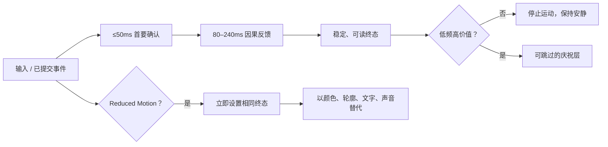
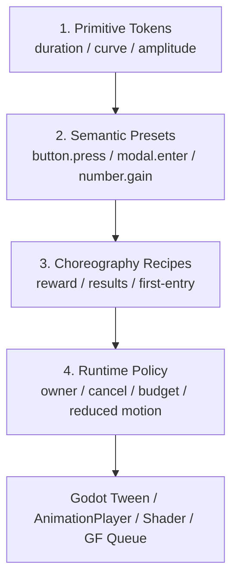

# 游戏 UI、Motion Design 与 Game Feel 长期参考资料库

> 调研快照：2026-07-30（Asia/Shanghai）
>
> 文档性质：设计研究与长期导航，不覆盖 [`visual_style.md`](./visual_style.md)、[`architecture.md`](./architecture.md) 或 [GF 项目合同](../.gf/project_contract.json) 的规范权威。
> 使用原则：学习设计机制、时间关系与信息层级，不复制作品美术、品牌资产或受限素材。

这份资料库服务于界面体验、按钮反馈、列表和弹层、HUD、奖励结算、状态变化与 Game Feel。它不是素材下载清单，也不是要求项目引入所有列出的代码库。最有价值的工作方式是：

1. 先按交互问题寻找真实案例视频；
2. 再用平台规范和可运行示例拆出时序、Easing、空间与中断规则；
3. 最后把结论转成项目自己的语义 Motion Preset，并同时定义 Reduced Motion 终态。

## 快速结论

### 最值得长期收藏的入口

| 优先级 | 资源 | 最适合解决什么问题 |
|---|---|---|
| ★★★★★ | [Game UI Database](https://www.gameuidatabase.com/) | 按游戏、界面类型、控制方式、纹理和 HUD 元素检索游戏 UI；视频可用于观察流程、状态和 Game Feel。 |
| ★★★★★ | [Interface In Game](https://interfaceingame.com/) | 从真实游戏的截图与视频研究主界面、背包、商店、HUD、奖励、加载和结算。 |
| ★★★★★ | [UI Motion](https://uimotion.fyi/) | 交互式拆解 30+ 个 Micro Interaction；同时给出 feeling、why、参数及 CSS/React/Motion 实现。 |
| ★★★★★ | [GDC Vault](https://www.gdcvault.com/) | 找到 UI、VFX、UX 与 Game Feel 的开发者第一手复盘，而不是只看成品截图。 |
| ★★★★★ | [Apple HIG Motion](https://developer.apple.com/design/human-interface-guidelines/motion)、[Xbox XAG 117](https://learn.microsoft.com/en-us/gaming/accessibility/xbox-accessibility-guidelines/117) | 用途、响应、帧率、Reduced Motion 与视觉干扰的底线。 |
| ★★★★★ | [Carbon Motion](https://carbondesignsystem.com/elements/motion/overview/)、[Material 3 Motion](https://m3.material.io/styles/motion/overview)、[Fluent Timing & Easing](https://learn.microsoft.com/en-us/windows/apps/design/motion/timing-and-easing) | 取得可落地的时长 Token 与 cubic-bezier 基准。 |
| ★★★★★ | [Godot 4.7 Tween](https://docs.godotengine.org/en/4.7/classes/class_tween.html)、[AnimationPlayer](https://docs.godotengine.org/en/4.7/classes/class_animationplayer.html)、[官方 Demo](https://github.com/godotengine/godot-demo-projects) | Godot 生命周期、API 和实现正确性的首选来源。 |
| ★★★★☆ | [Mobbin](https://mobbin.com/)、[Gamedexy](https://www.gamedexy.com/)、[Ripplix](https://www.ripplix.com/) | 补充产品级流程、移动游戏完整用户旅程和大规模 Motion 搜索。 |
| ★★★★☆ | [HUDS+GUIS](https://www.hudsandguis.com/)、[ArtStation Game UI](https://www.artstation.com/search?sort_by=relevance&query=game%20ui%20ux)、[Behance Game UI Motion](https://www.behance.net/search/projects/game%20ui%20motion) | 视觉语言、制作过程、专业设计师案例与概念探索。 |

### 对本项目的直接结论

- 本项目已有清楚边界：`GameUiMotionUtility` 统一局部 UI 动效；`GameBoardFeedbackUtility` 消费已提交的回合结果；`GameCelebrationVfxUtility` 负责里程碑庆祝；`GFScreenTransitionUtility` 只做主场景转场。外部库应先作为**词汇、参数与作者工具参考**，不能平行建立第二套所有权。
- 输入到首要反馈必须小于 `50ms`。按钮按下、焦点和合法目标不能等业务完成或等旧 Tween 播完。
- 演出只消费已提交状态；动画结束回调不能成为玩法真值。新的输入应从当前视觉值重定向，或明确 cancel/settle，不得排队播放陈旧状态。
- Reduced Motion 必须直接落到相同静态终态，不等待不可见 Tween；关闭震动只移除 Haptic，不改变其他反馈；`MINIMAL` 仍可保留预算内的小幅动作，但彩屑为 0、背景/庆祝 Shader 关闭。
- 当前 CMYK 半调纸片语言适合短、清楚、机械式动作；不应借用 blur、glow、长淡入、大视差或持续漂移作为默认风格。

## 1. 调研口径与维护方法

### 1.1 证据标记

- **[官方]**：平台规范、引擎文档、开发者演讲、项目仓库或设计师本人案例。
- **[开发者]**：制作团队明确解释的目标或过程。
- **[观察]**：依据截图、录屏或可运行样例做的设计分析，不宣称是原作团队意图。
- **[建议]**：本文综合平台规范、案例与本项目约束所得的调参起点，不是案例游戏公开的原始参数。

Live-service 游戏和在线资料会持续变化。案例应学习稳定机制，不把某次截图当成当前版本事实。GitHub Stars、最后提交和授权信息都按本页日期快照记录；计划采纳前必须重新查看仓库、Release、Issue 与许可证。

### 1.2 收藏条目应记录的字段

每个内部参考条目至少保留：

```yaml
id: reward/reveal/rare
source_url: "<original-source-url>"
captured_at: 2026-07-30
source_type: official-talk | game-video | interactive-demo | observation
trigger: reward_committed
purpose: 解释稀有奖励的来源、价值和落点
phases: [anticipation, reveal, travel, settle]
duration_ms: 650
curve: enter/out
distance_or_scale: "scale 0.94 -> 1.00"
interruption: skip_to_settled
owner: modal_generation
reduced_motion: static_final_plus_sound
notes: 不复制品牌资产；参数为项目化建议
```

推荐按**事件语义**打标签，而不是只按游戏名建文件夹：

`input/press`、`navigation/tab`、`overlay/popup`、`collection/inventory`、`economy/coin-fly`、`reward/reveal`、`progress/level-up`、`combat/critical`、`results/settlement`、`accessibility/reduced-motion`。

### 1.3 版权与来源治理

- 截图、GIF、视频和品牌资产仍归各自权利人所有；本库只保存原始链接、分析笔记和必要的内部引用信息。
- 不把 Dribbble、Pinterest、Behance、ArtStation 上的概念稿当作已验证的交互方案，更不能默认可商用。
- 代码仓库的 License 与演示素材的 License 可能不同。例如 GDQuest 的部分代码是 MIT，而配套美术是 `CC-BY-NC-SA`；商业项目必须分别核验。
- 链接失效时优先寻找作者、官方仓库、GDC、平台设计规范或 Internet Archive 的原始出处，不用无来源转载替代。

## 2. 全球高质量参考网站

### 2.1 游戏 UI、流程与 HUD 专项

| 资源 | 覆盖与优势 | 使用方式 | 限制 / 成熟度 | 收藏 |
|---|---|---|---|---|
| [Game UI Database](https://www.gameuidatabase.com/) | 2024 年 2.0 重构时公开为 1,341 款游戏、55,000+ 截图、1,700+ 视频；可按 screen、control、texture、pattern、HUD、color 等筛选。[发布报道](https://www.gamedeveloper.com/design/game-ui-database-relaunches-with-new-features-video-support-and-over-55-000-screenshots) | 先筛界面类型，再看同一游戏中的状态前后与视频；非常适合竞品矩阵。 | 免费；网页对自动抓取有限制，数量是带日期快照。 | ★★★★★ |
| [Interface In Game](https://interfaceingame.com/) | 数百款游戏，按 genre、theme、Menu、Inventory、Store、Loading、Progress、Overlay 等元素检索；大量条目含 UI 视频。 | 从具体表面进入，再横向比较不同游戏；案例章节的主要录像入口。 | 免费、志愿维护；不同游戏收录深度不一致。 | ★★★★★ |
| [Gamedexy](https://www.gamedexy.com/) | 2026 年出现的移动游戏 UX 资料库；真实录制的完整时间顺序流程，支持游戏原生 taxonomy、OCR 文案搜索。当前 [Flows](https://www.gamedexy.com/flows) 自述 1,887 屏、186 流程、25 款游戏。 | 研究 onboarding、monetization、retention、core loop、battle pass、daily reward 与 defeat-to-offer 的上下文。 | 发布早期；Open House 期间完整库免费，[计划价格](https://www.gamedexy.com/pricing)为 Pro `$9.99/月` 或 `$99/年`，需观察覆盖和持续性。 | ★★★★☆ |
| [HUDS+GUIS](https://www.hudsandguis.com/) | 游戏、电影与未来界面设计访谈、作品和过程。 | 研究 HUD 构图、世界观材质、Diegetic UI 和专业设计师方法。 | 更偏策展和访谈，不是统一 taxonomy 的数据库。 | ★★★★☆ |
| [Game Accessibility Guidelines](https://gameaccessibilityguidelines.com/full-list/) | 游戏无障碍完整清单，含文字、对比、输入与动态相关要求。 | 每次从案例提炼 Motion Preset 时同步检查“关闭、替代信号、阅读时间、闪烁”。 | 是设计检查清单，不替代真实玩家测试。 | ★★★★★ |
| [Xbox Accessibility Guidelines](https://learn.microsoft.com/en-us/xbox/accessibility/guidelines) | XAG 112 覆盖 UI 导航，XAG 117 专门处理滚动、闪烁、自动更新、相机移动与屏幕震动。 | 作为游戏特有 Reduced Motion 和视觉干扰门禁。 | 需要结合目标平台和玩法判断 essential motion。 | ★★★★★ |

### 2.2 Motion、Micro Interaction 与产品流程

| 资源 | 覆盖与优势 | 使用方式 | 限制 / 成熟度 | 收藏 |
|---|---|---|---|---|
| [UI Motion](https://uimotion.fyi/) / [文档](https://uimotion.fyi/docs) | 免费、开源、无付费墙；30+ 个交互组件，按 Micro、Gesture、Transition、Loading、Feedback、Delight 等分类，给出“感觉—原因—参数—代码”。 | 用精确卡片名检索，如 `Stagger Reveal`、`Number Counter`、`Toast Notification`、`Drag Reorder`、`Confetti Burst`。 | 2026 年 v0.1，样本仍在增长；Web 代码只能作为 Godot 时序参考。 | ★★★★★ |
| [Animation Patterns](https://animationpatterns.art/) | 65 个独立制作的 CSS/SVG Pattern，含实时 Demo、实现、无障碍与源码；覆盖 Popup、Sheet、布局切换、Progress、Toast、Shake、Badge 和数据变化。 | 当 UI Motion 没有对应模式时，用它补齐状态、错误和可访问实现；先读 [About](https://animationpatterns.art/about/)。 | 2026 新站；CC BY 4.0，复制时需要署名；长期稳定性待观察。 | ★★★★☆ |
| [Motion UI](https://motion.dev/ui) / [Motion Examples](https://motion.dev/examples) | 来自 Motion 团队的高质量可运行 section 和 interaction；含 press、hover、stagger、dialog、list、loader、add-to-basket、confetti。 | 直接操作、录屏、逐帧看中断与连续性，再转成语义参数。 | 部分内容属于 Motion+；Web 实现不直接引入 Godot。 | ★★★★☆ |
| [Mobbin](https://mobbin.com/) | 2026-07 页面显示 1,428 apps、621,500+ screens、323,900 flows；每周更新，视频能保留 micro-interaction 的时间上下文。 | 补充 Toast、Dialog、Tab、Loading、Checkout、Onboarding 等成熟产品模式。 | 不是游戏专库；免费层有限，完整研究通常需要订阅。 | ★★★★☆ |
| [Ripplix](https://www.ripplix.com/) | 网站自述 7,000+ 动画、1,000+ 真实 app/site，覆盖 Mobile、Web、Watch、AR/VR。 | 用于大范围 Motion 搜索和趋势扫描。 | 新资源，规模为站方声明；先观察检索质量、定价与长期维护。 | ★★★★☆ |
| [Page Flows](https://pageflows.com/) | 真实产品的流程视频与逐屏步骤。 | 研究购买、订阅、错误、删除、通知许可等完整流程，而不是孤立帧。 | 通常需要付费；游戏覆盖有限。 | ★★★★☆ |
| [Codrops](https://tympanus.net/codrops/) | 高质量交互实验、页面转场、Shader 与可运行源码。 | 寻找遮罩、网格、文本、滚动与 Canvas/WebGL 的表现机制。 | 偏探索性 Web 效果；可访问性、性能和游戏输入需重新设计。 | ★★★★☆ |
| [Easings.net](https://easings.net/) | 常见 Easing 的可视曲线和代码形式。 | 讨论参数时统一语言，快速比较 Quad/Cubic/Back/Elastic。 | 只解决曲线，不解决用途、生命周期或信息层级。 | ★★★★★ |
| [Liquid & Grit Database](https://product.liquidandgrit.com/information-by-product/impact-portal/database-tool) | 移动 F2P 商业化专项，站方称有 34,000+ 可搜索截图和玩法视频。 | 深挖礼包、活动、留存、货币、奖励和付费循环。 | 企业付费、通常询价；不适合作为团队人人可用的基础入口。 | ★★★★☆ |

> 注意：`uimotion.design` 是商业 Motion/UI 服务；本文推荐的免费模式库是 [`uimotion.fyi`](https://uimotion.fyi/)，两者不要混淆。

### 2.3 视觉发现与作品社区

| 资源 | 强项 | 正确用法 | 风险 | 收藏 |
|---|---|---|---|---|
| [Dribbble：Game UI Animation](https://dribbble.com/tags/game-ui-animation) | 快速看按钮、卡片、奖励和概念稿的视觉方向。 | 收集 mood、构图与单个瞬间，随后寻找可操作原型或真实产品验证。 | 常只有精修循环 GIF，缺少输入、失败、关闭和长文本状态。 | ★★★☆☆ |
| [Behance：Game UI Motion](https://www.behance.net/search/projects/game%20ui%20motion) | 完整 Case Study、设计过程、Motion Reel。 | 看目标、探索、组件集与最终影片的关联。 | 作者自述质量不一；演示不等于已上线实现。 | ★★★★☆ |
| [ArtStation：Game UI/UX](https://www.artstation.com/search?sort_by=relevance&query=game%20ui%20ux) | 专业 Game UI Artist、HUD、图标、VFX 与工作流程。 | 研究游戏特有的风格化资产和作品拆解。 | 以视觉表现为主，交互和可访问性证据较少。 | ★★★★☆ |
| [Pinterest：Game UI Motion](https://www.pinterest.com/search/pins/?q=game%20ui%20motion) | 宽泛发现与主题板。 | 只作为发现入口，沿链接追到作者原页。 | 重复、失去原作者、过期或错误归因最严重。 | ★★☆☆☆ |
| [Awwwards：Animation](https://www.awwwards.com/websites/animation/) | 高表现网页、转场、排版和材质。 | 研究主界面气氛、展示页和少量低频仪式。 | 往往以营销冲击力优先，不适合高频游戏 UI。 | ★★★☆☆ |
| [Recent](https://recent.design/)（原 Godly） | Godly 的现行站点，覆盖 Web、Interface、Motion、3D 和品牌。 | 研究视觉层级、节奏和高级感。 | 强在视觉方向，弱在交互机制和参数；`godly.website` 当前会跳转到 Recent。 | ★★★☆☆ |
| [CollectUI](https://collectui.com/) | 基于 Dribbble 的分类归档，覆盖 Animation、UI Interaction 与常见页面类型。 | 用于空状态、设置、资料卡等静态构图补充。 | 近期活跃度低、缺少流程，不适合 Motion 主研究。 | ★★☆☆☆ |

这些社区适合回答“可能长什么样”，不适合单独回答“输入后如何响应、能否打断、长列表是否稳定、Reduced Motion 是否仍可理解”。

### 2.4 第一手课程、演讲与书

| 资源 | 价值 | 收藏 |
|---|---|---|
| [Game Feel: A Game Designer's Guide to Virtual Sensation](https://www.routledge.com/Game-Feel-A-Game-Designers-Guide-to-Virtual-Sensation/Swink/p/book/9780123743282) | Steve Swink 的系统性基础：输入、响应、空间、上下文、润色共同构成虚拟感觉。 | ★★★★★ |
| [Game Feel Design Survey](https://arxiv.org/abs/2011.09201) | 从研究角度把 Game Feel 定义为对 moment-to-moment interaction 的有意情感设计。 | ★★★★☆ |
| [Microinteractions：trigger、rules、feedback、loops & modes](https://www.interaction-design.org/literature/article/micro-interactions-ux) | 把一个小交互从“动画”提升为包含触发、规则、反馈和持续状态的完整系统。 | ★★★★★ |
| [Juice it or Lose it](https://www.youtube.com/watch?v=Fy0aCDmgnxg) | 从极简游戏逐层加入运动、粒子、声音和震动，直观看出 Juice 的边际价值。 | ★★★★★ |
| [The Art of Screenshake](https://www.youtube.com/watch?v=AJdEqssNZ-U) | 研究受击、时间、屏幕震动、粒子与强度分级，也提醒不要把震动当通用答案。 | ★★★★★ |
| [Game Feel: Why Your Death Animation Sucks](https://www.gdcvault.com/play/1022759/Game-Feel-Why-Your-Death) | 用死亡反馈逐层说明信息、节奏、动画、音效和粒子如何从“可用”变成“有感觉”。 | ★★★★★ |
| [VFX as a Game Design Language（GDC 2022 slides）](https://media.gdcvault.com/GDC%2B2022/Speaker%2BSlides/VFXasagamedesignlanguage_Nguyen_An-Tim.pdf) | 把 VFX 当成玩法语言与因果提示，而不只是美术附加层。 | ★★★★☆ |

[](https://www.youtube.com/watch?v=Fy0aCDmgnxg)
[](https://www.youtube.com/watch?v=AJdEqssNZ-U)
[](https://www.youtube.com/watch?v=pmSAG51BybY)

## 3. Motion Design 基础与可执行参数

### 3.1 先区分四个层次

| 层次 | 关心的问题 | 例子 |
|---|---|---|
| Micro Interaction | 一次触发的规则、反馈和后续状态是什么？ | Press、Toggle、Hold、错误、Tooltip。 |
| UI Motion | 信息如何进入、离开、重排并保持空间连续性？ | Popup、Tab、List Stagger、Shared Element。 |
| Game Feel | 输入、玩法结果、视觉、声音、触觉和时间感如何共同形成“手感”？ | 合并冲击、受击、资源飞入、数字连锁。 |
| Juice | 在不破坏可读性和性能的前提下，哪些次级反馈能增加愉悦和强调？ | 小幅回弹、纸屑、短震动、稀有奖励停顿。 |

漂亮的动画不一定是好的 Micro Interaction。完整设计必须回答：谁触发、真实规则是什么、第一帧如何反馈、能否取消或反向、业务失败如何表现、循环多久、关闭动态后靠什么理解。

### 3.2 平台与设计系统基准

| 来源 | 公开基准 | 应如何借鉴 |
|---|---|---|
| [Apple HIG Motion](https://developer.apple.com/design/human-interface-guidelines/motion) | Motion 应有目的、简短精确、可取消；游戏应维持流畅帧率并精确连接动作与结果。系统组件应响应 Reduced Motion。 | 用于判断“要不要动”与可访问性，不把 Apple 的视觉外观照搬进游戏。 |
| [Material 3 Motion](https://m3.material.io/styles/motion/overview) / [Token specs](https://m3.material.io/styles/motion/easing-and-duration/tokens-specs) | 当前标准曲线 `(0.2,0,0,1)`、enter `(0,0,0,1)`、exit `(0.3,0,1,1)`；16 档 `50–1000ms` token，并提供 Standard / Expressive 与 Spring 语义。历史规范另有移动端进入约 `225ms`、退出约 `195ms` 的参考。 | 新设计按 M3 语义 Token；旧版精确参数只作跨平台历史标尺。距离和面积越大，时长才相应增加。 |
| [Fluent 2 Motion](https://fluent2.microsoft.design/motion) / [WinUI Timing](https://learn.microsoft.com/en-us/windows/apps/design/motion/timing-and-easing) | `83 / 167 / 250ms` 三档；Enter `cubic-bezier(0,0,0,1)`，Exit `cubic-bezier(1,0,1,1)`。 | 对键鼠/桌面游戏特别有参考价值；高频导航使用较短档。 |
| [Carbon Motion](https://carbondesignsystem.com/elements/motion/overview/) | Duration tokens：`70 / 110 / 150 / 240 / 400 / 700ms`；Microinteraction 推荐 `90–120ms`。Productive standard `.2,0,.38,.9`，enter `0,0,.38,.9`，exit `.2,0,1,.9`；另有 expressive 曲线。 | 很适合拆成项目 Fast/Normal/Ceremony Token，并区分高频 productive 与低频 expressive。 |
| [Atlassian Motion](https://atlassian.design/foundations/motion/) | Interaction `50–150ms`；Transition `150–400ms`；dropdown 约 `150ms`、modal 约 `250ms`。Bold out `0,.4,0,1`，bold in/out `.4,0,0,1`。 | 说明高频动作应短、退出更快；该基础在 2026 年仍标 Early Access，参数需带版本意识。 |
| [Adobe Spectrum Motion](https://spectrum.adobe.com/page/motion/) | Micro `130 / 160 / 190 / 220ms`，Macro `250–500ms`；enter `(0,0,.4,1)`、exit `(.5,0,1,1)`、place-to-place `(.45,0,.4,1)`。 | 页面有 Fade、Slide、Fill、Expand、Scale 等交互示例，适合补充专业工具型界面的克制 Motion。 |
| [W3C WCAG 2.2: Animation from Interactions](https://www.w3.org/WAI/WCAG22/Understanding/animation-from-interactions) | 由交互触发的非必要 Motion 应能被关闭；不能只靠动画表达必要状态。 | Reduced Motion 是组件契约，不是最后统一把 duration 乘 0.5。 |
| [Xbox XAG 117](https://learn.microsoft.com/en-us/gaming/accessibility/xbox-accessibility-guidelines/117) | 玩家应能暂停或关闭滚动、闪烁、自动更新和非必要运动，并可配置 camera shake 等。 | 对游戏 HUD、背景运动、屏幕震动和自动消失文本比普通 Web 规范更直接。 |

#### Material 3 当前精确 Token

[Applying Easing and Duration](https://m3.material.io/styles/motion/easing-and-duration/applying-easing-and-duration)、[Android 官方 Motion Token](https://github.com/material-components/material-components-android/blob/master/docs/theming/Motion.md) 与 [Material Motion Codelab（含动画）](https://developer.android.com/codelabs/material-motion-android) 可作为实现对照。

| 用途 | Cubic Bézier |
|---|---|
| Standard / 屏内移动 | `(0.2, 0, 0, 1)` |
| Standard enter / decelerate | `(0, 0, 0, 1)` |
| Standard exit / accelerate | `(0.3, 0, 1, 1)` |
| Emphasized enter | `(0.05, 0.7, 0.1, 1)` |
| Emphasized exit | `(0.3, 0, 0.8, 0.15)` |
| Linear | `(0, 0, 1, 1)` |

Duration token 共 16 档：

```text
50, 100, 150, 200, 250, 300, 350, 400,
450, 500, 550, 600, 700, 800, 900, 1000 ms
```

Material 3 还公开 Spring token：

| Spring | Damping ratio | Stiffness |
|---|---:|---:|
| Fast spatial | 0.9 | 1400 |
| Fast effects | 1.0 | 3800 |
| Default spatial | 0.9 | 700 |
| Default effects | 1.0 | 1600 |
| Slow spatial | 0.9 | 300 |
| Slow effects | 1.0 | 800 |

这些物理值是外部参考，不应成为项目硬编码的跨平台真值。项目层应消费 `productive`、`expressive`、`spatial`、`effect` 等语义，再由 Godot Profile 定义具体曲线。

### 3.3 推荐的语义时长 Token

以下是结合规范与本项目已有参数后的**项目化建议**，不是任何案例游戏的官方测量值：

| Token | 时长 | 典型用途 | 项目注意 |
|---|---:|---|---|
| `instant` | `50–80ms` | Press 首帧、焦点确认、合法/非法目标切换 | 首要反馈仍应尽可能同帧建立视觉状态。 |
| `fast` | `90–140ms` | Hover、selected、关闭、短 pulse | 当前按钮 pressed `~52ms`、hover 第一段 `~58ms` 与此一致。 |
| `normal` | `150–220ms` | Popup、Tab、列表项、普通内容切换 | 当前 panel `180ms`、content switch `150ms`、numeric `220ms`。 |
| `slow` | `240–420ms` | 大面板、共享元素、资源飞行、重要状态 | 必须可打断；不用于每次点击。 |
| `ceremony` | `500–1200ms` | 稀有奖励、结算、升级、首次开场 | 可加速/跳过；重复观看用短版。 |

推荐曲线词汇：

```text
enter/out       cubic-bezier(0.16, 1, 0.3, 1)   快速响应、柔和落定
standard        cubic-bezier(0.4, 0, 0.2, 1)    同屏状态或位置切换
exit/in         cubic-bezier(0.4, 0, 1, 1)      快速离场，不超调
productive-out  cubic-bezier(0.2, 0, 0.38, 0.9) 高频、克制
linear          linear                            连续旋转、真实进度、1:1 手势
```

`Back/Elastic/Spring` 只用于小对象、稀有奖励或释放回弹；缩放超调通常不超过 `1.02–1.05`。不要同时给同一对象叠加大位移、大缩放、旋转和强粒子。

### 3.4 通用 Motion Pattern

1. **Direct manipulation**：拖拽、滚动、Scrub 直接跟随输入，不套普通慢 Tween。
2. **Enter establishes hierarchy**：遮罩或阻断关系先建立，内容再小位移/缩放进入；控件不能等动画结束才可理解。
3. **Exit is faster**：玩家已经决定离开，退出通常比进入短 `20–35%`，不做超调。
4. **Stagger explains order**：只对新创建且可见项按阅读顺序错峰，并给总延迟封顶；刷新已有内容不整页重播。
5. **Continuity explains causality**：卡片到详情、资源到计数器、物品到槽位应保留来源和落点。
6. **Anticipation is scarce**：预热停顿只给重要、低频、可跳过的奖励；普通操作先响应，不人为等待。
7. **Settle is the contract**：正常完成、取消、Owner 退出、新 generation 和 Reduced Motion 都必须汇合到同一个稳定终态。



### 3.5 Game Feel / Juice 的强度阶梯

| 层 | 职责 | 示例 | 约束 |
|---|---|---|---|
| 0. Truth | 玩法状态已提交、数值正确。 | 2048 合并结果、奖励数量。 | 不依赖演出回调。 |
| 1. Readability | 告诉玩家发生了什么、来自哪里。 | 位移、落点、数字变化、合法目标。 | 高频、短、必须存在替代信号。 |
| 2. Tactility | 表达重量和材质。 | 纸片按压、短回弹、轻震、碰撞声。 | 幅度小，输入立即接管。 |
| 3. Emphasis | 标记更重要的事件。 | 稀有度边框、局部 VFX、短停顿。 | 与价值成比例，不占满屏幕。 |
| 4. Celebration | 建立高潮与记忆点。 | 彩屑、奖励序列、结算节拍。 | 低频、可跳过、Reduced Motion 有静态版。 |

好的 Juice 是因果链：`来源触发 → 对象移动 → 到达目标 → 数字更新 → 状态确认`。如果所有层同时爆发，玩家反而看不出原因。

### 3.6 Reduced Motion 与可访问性门禁

- 关闭背景漂移、视差、屏幕震动、自动滚动和非必要循环；保留状态的颜色、轮廓、图标、文字和声音。
- Stagger 合并为同时呈现；Popup 和 Screen Transition 直接到稳定帧，不能等待不可见时长。
- 错误 Shake 同时显示静态错误文案；危险状态不能只靠脉冲、闪烁或颜色。
- 自动消失文本根据阅读量延长；关键错误、购买确认和不可逆操作不应仅用 Toast。
- 遵守 [Three Flashes or Below Threshold](https://www.w3.org/WAI/WCAG22/Understanding/three-flashes-or-below-threshold)：任何一秒内不超过三次闪烁，除非明确低于安全阈值。
- 遵守 [Pause, Stop, Hide](https://www.w3.org/WAI/WCAG22/Understanding/pause-stop-hide)：与其他内容并行、自动运动/闪烁/滚动超过五秒的非必要内容要能暂停、停止或隐藏。
- 对屏幕阅读、键盘/手柄 focus、44px 触控热区和暂停态做真实测试。动画的内部 Presenter 可以变换，命中和布局根节点保持稳定。

## 4. GitHub、源码可见库与动画框架

### 4.1 快照与状态口径

本节 Stars 是 `2026-07-30` 的 GitHub API 快照，不代表质量，也会持续变化：

- **活跃**：近 6 个月有实质提交或 Release。
- **低频 / 稳定期**：6–18 个月无实质功能提交，或近期仅有文档、License 等维护。
- **停更迹象**：18 个月以上没有实质提交且未归档。
- **归档**：GitHub `archived=true`。本次列出的仓库均未归档。

“值得参考”评价的是设计、API、作者工具或实现思想；“建议引入”还要考虑 Godot 4.7、GF 生命周期、License、性能和与现有所有权是否重叠。

参考星级不是 GitHub Stars 的换算。本文大致按“Godot 4.7 / GF 适配 35%、模式与复用价值 25%、维护 20%、文档与可视 Demo 10%、许可清晰度 10%”综合判断，所以小而专注的连续 Spring 项目可能高于热门但版本不匹配的素材库。

> GSAP、DOTween、PrimeTween 是源码可见或自定义许可项目，并非 OSI 意义的开源软件。Animate.css 使用 Hippocratic License 2.1。不能只看“免费”或仓库公开就假定可按 MIT 处理。

### 4.2 跨引擎 Tween / Motion / UI Animation

这些项目主要作为**设计、时间线和 API 参考**，不能把 JavaScript/C#/Unity 实现直接移植为 GDScript。

| 仓库 | Stars | 维护 / License | 核心特点 | 是否值得参考与本项目建议 |
|---|---:|---|---|---|
| [greensock/GSAP](https://github.com/greensock/GSAP) | 27,191 | 2026-04-13；`3.15.0`；活跃。GreenSock Standard “no charge” 自定义许可。 | 成熟的 Timeline、label、position parameter、stagger、FLIP、MotionPath、morph、overwrite/kill。 | ★★★★★。重点学习时间线定位语法、列表重排、stagger 生成器和覆盖/终止语义；[文档](https://gsap.com/docs/)、[Eases](https://gsap.com/docs/v3/Eases/)、[许可](https://gsap.com/standard-license/)。不移植源码。 |
| [juliangarnier/anime](https://github.com/juliangarnier/anime) | 71,595 | 2026-06-22；`v4.5.0`；活跃。MIT。 | 多目标动画、timeline、中心/网格 stagger、spring/easing、SVG path、draggable、scope cleanup。 | ★★★★★。很适合参考 declarative params、网格波次和作用域清理；实现仍用 Godot Tween/Curve。[文档](https://animejs.com/documentation/) |
| [motiondivision/motion](https://github.com/motiondivision/motion) | 33,007 | 2026-07-28；活跃。MIT。 | React/JS/Vue；spring、gesture/drag、layout/shared transition、scroll-linked、330+ 官方示例。 | ★★★★★。研究 Hover/Tap/Drag 状态合成、保留速度的 spring、Tab indicator 和 Grid 重排；[Examples](https://motion.dev/examples)。 |
| [formkit/auto-animate](https://github.com/formkit/auto-animate) | 13,880 | 2026-07-10；`v0.10.0`；活跃。MIT。 | 近零配置 FLIP：对子项新增、移除、移动自动补间。 | ★★★★★。把“旧 rect → 新 rect → invert → play”转成 Godot `Control` global rect 快照，可用于背包排序、奖励列表与设置项插删；[Demo](https://auto-animate.formkit.com/)。 |
| [tweenjs/tween.js](https://github.com/tweenjs/tween.js) | 10,129 | 最新提交 2025-01-11；`v25.0.0` 发布于 2024-07-26；低频 / 稳定期。MIT。 | 小型 Tween core、Robert Penner easing、外部驱动 update loop、大量基础示例。 | ★★★☆☆。适合核对曲线与分组更新算法，不是本项目 2026 年首选依赖；[Examples](https://tweenjs.github.io/tween.js/examples/)。 |
| [Demigiant/dotween](https://github.com/Demigiant/dotween) | 2,666 | 2026-07-26；`v1.2.815`；活跃。自定义 DOTween 许可。 | Unity Sequence 的 `Append/Join/Insert`、loop、path、shortcut、callback、按 ID kill、Safe Mode；含 UGUI 示例。 | ★★★★★。学习 Sequence recipe、owner/ID 终止和组合语法；[文档](https://dotween.demigiant.com/documentation.php)、[UGUI/Sequence 示例](https://github.com/Demigiant/dotween/tree/develop/UnityExamples.Unity5/Assets/DOTween%20Examples)、[许可](https://github.com/Demigiant/dotween/blob/develop/LICENSE)。不移植源码。 |
| [KyryloKuzyk/PrimeTween](https://github.com/KyryloKuzyk/PrimeTween) | 1,954 | 2026-07-18；`1.4.10`；活跃。自定义许可。 | Unity 零分配热路径、Sequence、speed-based/custom ease、Inspector authoring、debug。 | ★★★★☆。学习 handle 生命周期、性能测量和 Inspector 参数面板；许可限制使其更适合作为设计参考。[README](https://github.com/KyryloKuzyk/PrimeTween#readme)、[许可](https://github.com/KyryloKuzyk/PrimeTween/blob/main/LICENSE)。 |
| [annulusgames/LitMotion](https://github.com/annulusgames/LitMotion) | 2,257 | 2026-06-30；`v2.0.2`；活跃。MIT。 | Unity struct/DOTS、zero allocation、LSequence、文本动画和 Inspector 组件。 | ★★★★☆。重点看 cancel/complete、sequence、数字文本和作者工具；[Samples](https://github.com/annulusgames/LitMotion/tree/main/samples/LitMotion.Samples)、[Inspector GIF](https://github.com/annulusgames/LitMotion/blob/main/docs/images/img-litmotion-animation.gif)。 |
| [animate-css/animate.css](https://github.com/animate-css/animate.css) | 82,715 | main 实质提交 2024-03-02；最后 Release `v4.1.1` 为 2020-09-07；停更迹象。Hippocratic License 2.1。 | 大量 CSS enter/exit/attention-seeker 预设与清晰命名。 | ★★★☆☆。可用来建立“预设词汇反例库”和观察哪些效果过强；不建议引入，也不要把其 License 当 MIT。[动画目录](https://animate.style/)、[License](https://github.com/animate-css/animate.css/blob/main/LICENSE)。 |

### 4.3 Godot UI Animation、Tween、Shader 与 Framework

先从内建能力出发。[Godot 4.7 Tween](https://docs.godotengine.org/en/4.7/classes/class_tween.html) 已支持 `parallel()/chain()`、`tween_subtween()`、`tween_await(signal).set_timeout()`、`bind_node()`、`kill()` 和 `TRANS_SPRING`；另有 [AwaitTweener](https://docs.godotengine.org/en/4.7/classes/class_awaittweener.html) 与 [SubtweenTweener](https://docs.godotengine.org/en/4.7/classes/class_subtweentweener.html)。官方明确说明：

- Tween 不能复用，重播应创建新实例；
- 不要让多个 Tween 并发写同一对象的同一属性；
- 需要打断时保存 handle 并 `kill()`；
- `bind_node()` 能在 owner 释放时自动终止。

运行时才知道终值、需要轻量重定向的反馈优先 Tween；固定终值、需要美术在编辑器里反复调轨道的演出优先 [AnimationPlayer](https://docs.godotengine.org/en/4.7/classes/class_animationplayer.html)，参见 [Animation track types](https://docs.godotengine.org/en/4.7/tutorials/animation/animation_track_types.html)。`AnimationTree` 的 blend/state-machine 更适合角色或复杂连续动画，普通 Control UI 通常没有必要。项目 Motion Library 应是“官方 Tween/AnimationPlayer + GF owner/cancel”的薄语义层；第三方工具的主要增量是 Preset、Inspector、Preview、连续 Spring 与视觉 Graph，而不是替代引擎或 GF 生命周期。

| 仓库 | Stars | 维护 / License | Godot 与核心定位 | 是否值得参考与本项目建议 |
|---|---:|---|---|---|
| [godotengine/godot-demo-projects](https://github.com/godotengine/godot-demo-projects) | 9,255 | 2026-07-29；活跃、官方。MIT。 | 官方 Tween、GUI、2D Shader、Particles 与各类 canonical 示例；master 对应下一个 4.x。 | ★★★★★。API 正确性的第一选择；固定看 4.7 分支或 tag，不从 master 直接抄可能变化的 API。[在线 Demo](https://godotengine.github.io/godot-demo-projects/) |
| [ceceppa/anima](https://github.com/ceceppa/anima) | 763 | `revive` 分支 2026-07-28 实质复苏；main 为 2024-09-16；尚无新 Release。MIT。 | main Godot 4.3、revive Godot 4.6；89 preset、33 easing、串/并行、Grid stagger、CSS-like 自定义。 | ★★★★★。非常适合形成 Popup/List/Grid 动效词汇和 DSL；只锁 commit 做 POC，不追未发布分支，也不默认其 cancel/owner 契约满足 GF。[GIF](https://media.githubusercontent.com/media/ceceppa/anima/main/docs/assets/images/anima.gif)、[Live demo](https://ceceppa.me/anima-demo/) |
| [HungryProton/proton_control_animation](https://github.com/HungryProton/proton_control_animation) | 147 | 2026-07-26；活跃。MIT。 | Godot 4.7；给现有 `Control` 挂子节点，以 Resource 表达动画，支持 hover 触发、`start()` 和自定义扩展。 | ★★★★★。与当前版本和 MotionPreset 方向高度匹配，优先隔离 POC；播放、cancel、teardown、Reduced Motion 仍接入 GF owner。[Docs](https://hungryproton.github.io/proton_control_animation/)、[Examples](https://github.com/HungryProton/proton_control_animation/tree/main/addons/proton_control_animation/examples) |
| [gurbsgurbs/tween-composer-godot](https://github.com/gurbsgurbs/tween-composer-godot) | 35 | 2026-07-16；`v0.5.1`；活跃。MIT。 | Godot 4.4+，示例已到 4.7；Inspector 编排 2D/3D/UI、Resource 复用、编辑器预览、信号触发。 | ★★★★★。研究 authoring/preview 体验价值很高；实际播放仍由项目 owner/cancel 语义包裹。[Hero/Inspector](https://raw.githubusercontent.com/gurbsgurbs/tween-composer-godot/refs/heads/main/.github/assets/TweenComposer_Hero.png) |
| [Kelpekk/Juicee](https://github.com/Kelpekk/Juicee) | 73 | 2026-07-27；`v1.4.0`；活跃。MIT。 | Godot 4.3+；99 effects、可视化 graph、Curve easing、screen shader、状态栈和 accessibility。 | ★★★★★。Game Feel taxonomy、Curve、状态栈和 Reduced Motion 的高价值参考。它与 GF feedback/queue/transition 重叠，不建议整包接管；[Demo/docs](https://github.com/Kelpekk/Juicee#-demo)。 |
| [cashew-olddew/Universal-Transition-Shader](https://github.com/cashew-olddew/Universal-Transition-Shader) | 499 | 2026-03-18；活跃。CC0-1.0。 | demo Godot 4.6；单个 CanvasItem shader 支持 wipe、mask、iris、clock、grid stagger 等。 | ★★★★★。直接借鉴场景遮罩和奖励揭示；由 `progress` 接 `GFScreenTransitionUtility` 并保留静态 fallback。[Recipes/GIF](https://github.com/cashew-olddew/Universal-Transition-Shader/tree/main/assets/recipes)、[视频](https://www.youtube.com/watch?v=PtBZs7OvR2Y) |
| [KoBeWi/Godot-Tween-Suite](https://github.com/KoBeWi/Godot-Tween-Suite) | 135 | 2026-07-19；活跃、尚无 Release。MIT。 | Godot 4 Tween API；`TweenNode`、可复用 `TweenAnimation` Resource、Inspector 编辑。 | ★★★★☆。对 MotionPreset 和作者工具有启发；先审预览态/运行态隔离、4.7 兼容与取消语义。 |
| [EvilBunnyMan/TweenFX](https://github.com/EvilBunnyMan/TweenFX) | 184 | 2026-03-28；`v1.2.0`；活跃。MIT。 | Godot 4；shake、pop、bounce、punch、float 等 juicy 预设，一行 API、停止和循环控制。 | ★★★★☆。适合按钮、奖励、数字和 Tile 原型；若采纳需补 owner teardown、同属性冲突与 Reduced Motion 测试。[Releases/demo](https://github.com/EvilBunnyMan/TweenFX/releases) |
| [ydipeepo/godot-motion](https://github.com/ydipeepo/godot-motion) | 12 | 2026-05-13；`v1.1.0`；活跃、样本小。MIT。 | Godot 4.6；连续物理过渡，重定目标时保留速度，Preset Resource；依赖 `godot-task` / `godot-easing`。 | ★★★★☆。对 Hover↔Press↔Release 反转、拖拽回弹很有价值；先参考算法，不未经压测就引入三库依赖。 |
| [murikistudio/simple-gui-transitions](https://github.com/murikistudio/simple-gui-transitions) | 205 | 2026-01-03；`v0.5.0`；活跃。MIT。 | Godot 4.x；layout enter/leave、分组/子项 stagger、阻止转场中交互、await 完成。 | ★★★★☆。适合研究 Popup/Tab/HUD；不能让其 singleton 替代 `GFUIRouterUtility`。[示例](https://github.com/murikistudio/simple-gui-transitions/tree/godot-4/addons/simple-gui-transitions/example) |
| [Maaack/Godot-Game-Template](https://github.com/Maaack/Godot-Game-Template) | 1,561 | 2026-07-28；`v1.4.8`；活跃。MIT。 | Godot 4.7 / 4.3+；Main、Options、Pause、Credits、动画、scene loader、accessibility。 | ★★★★☆。完整 UI 流程、焦点和设置菜单标杆；本项目已有 GF 架构，只提取页面组成和规范。[itch demo](https://maaack.itch.io/godot-game-template)、[视频](https://youtu.be/U9CB3vKINVw) |
| [Maaack/Godot-Menus-Template](https://github.com/Maaack/Godot-Menus-Template) | 460 | 2026-07-29；`v1.4.8`；活跃。MIT。 | Godot 4.7 / 4.3+；菜单动画、loading、shader pre-cache、accessibility。 | ★★★★☆。比完整模板更适合定点研究 Main/Pause/Options；借视觉层与预热流程，不替换 GF 路由。 |
| [Maaack/Godot-Scene-Loader](https://github.com/Maaack/Godot-Scene-Loader) | 71 | 2026-07-13；`v1.4.7`；活跃。MIT。 | Godot 4.7 / 4.3+；异步加载、progress、错误与停滞显示。 | ★★★★☆。重点研究 Loading/Progress/Error 三态；异步终态与迟到回调继续由项目 owner 管。[Media](https://github.com/Maaack/Godot-Scene-Loader/tree/main/addons/maaacks_scene_loader/media) |
| [glass-brick/Scene-Manager](https://github.com/glass-brick/Scene-Manager) | 624 | 2026-07-23；`v2.0.0`；活跃。addon 内 MIT。 | v2 demo Godot 4.7；scene transition、shader fade、可选 loading、跨场景 node refs。 | ★★★★☆。Shader fade 和等待点值得借；不要引入其 scene ownership 与 GF route operation 竞争。[GIF](https://github.com/glass-brick/Scene-Manager/blob/main/scene_manager_demo.gif) |
| [rockgem/godot-ui-animation-library](https://github.com/rockgem/godot-ui-animation-library) | 135 | 2026-03-19；活跃但未正式 Release。MIT。 | 示例工程 Godot 4.4；Control 的 slide、pop、bounce、rotate、fade 等函数。 | ★★★☆☆。适合快速查命名和参数，抽象与发布成熟度不足以作为长期核心依赖。 |
| [Eneskp3441/Shaker](https://github.com/Eneskp3441/Shaker) | 455 | 2024-09-15；`v1.0.7`；停更迹象。MIT。 | Godot 4.2+；camera、node、任意属性 shake 与 emitter。 | ★★★☆☆。只作 shake 参数与 emitter 参考；项目继续由 GF Shake 统一预算、打断与 Reduced Motion。[视频](https://youtu.be/SUgHkyyns1k) |
| [gdquest-demos/godot-shaders](https://github.com/gdquest-demos/godot-shaders) | 4,047 | 2026-05-16 仅 License 变更；Godot 4 port 未完成；低频 / WIP。代码 MIT，美术 `CC-BY-NC-SA-4.0`。 | main 正在从 Godot 3 移植到 4.3。 | ★★★★☆。Shader 技法值得长期收藏；4.7 逐个移植和验证代码，商业项目绝不直接复用 NC 美术。[Port tracker](https://github.com/gdquest-demos/godot-shaders/issues/53) |
| [gdquest-demos/godot-4-new-features](https://github.com/gdquest-demos/godot-4-new-features) | 525 | 2026-05-16 仅 License 变更；教学型低频。代码 MIT，美术 `CC-BY-NC-SA-4.0`。 | Godot 4 系列，含 Tween、动画、粒子和 UI 示例。 | ★★★☆☆。适合机制入门；参数和 API 最终以 4.7 官方文档/官方 Demo 为准。[Tweens](https://github.com/gdquest-demos/godot-4-new-features/tree/main/tweens) |

[](https://github.com/ceceppa/anima)

[](https://github.com/gurbsgurbs/tween-composer-godot)

### 4.4 Godot Asset Library / Shader 入口

Asset Library 条目未必有独立 GitHub 仓库，因此 Stars 记为 `N/A`；采纳前仍要打开源码和许可证。

| 条目 | Stars | 版本 / License | 适合研究什么 | 建议 |
|---|---:|---|---|---|
| [Tween Animation 1.1.1](https://godotengine.org/asset-library/asset/4480) | N/A | Godot 4.5；MIT；2025-12-07 提交 | 节点式编辑、预览、重放、场景复用。 | ★★★★☆；作者工具参考。 |
| [Tween Orchestrator 1.0.2](https://godotengine.org/asset-library/asset/4253) | N/A | Godot 4.5+；MIT | Inspector 中的 clip/resource 与复用。 | ★★★★☆；研究编排，不接管 GF owner。 |
| [UI Responsive Animations 1.1.3](https://godotengine.org/asset-library/asset/4534) | N/A | Godot 4 C#；GPL-3.0 | motion、opacity、splash、blend、loop，不依赖 AnimationPlayer。 | ★★★☆☆；可观察 API，GPL 不作为本项目默认依赖。 |
| [Tween Composer 0.5.1](https://godotengine.org/asset-library/asset/5108) | 35（GitHub） | Godot 4.4+；MIT；2026-07-17 更新 | Resource Tween、Inspector preview、signal trigger。 | ★★★★★；对应上表仓库，优先隔离 POC。 |
| [Universal Transition Shader](https://store.godotengine.org/asset/cashew-olddew/universal-transition-shader/) | 499（GitHub） | Godot 4.4+；CC0；2026-06-09 商店更新 | 可参数化 wipe/mask/iris/grid 转场。 | ★★★★★；优先抽取适合纸张语言的少数配方。 |
| [Godot Shaders：UI tag](https://godotshaders.com/shader-tag/ui/) / [Progress tag](https://godotshaders.com/shader-tag/progress/) | N/A | 每条独立 License | UI 遮罩、进度、故障、描边、波纹等配方。 | ★★★★☆；逐条核对代码与图片授权，控制 overdraw 和移动端精度。 |

### 4.5 开源评估结论

1. **实现真值优先级**：Godot 4.7 官方文档 / Demo → 项目已有 Utility → 隔离 POC → 第三方 addon。
2. **最值得借的不是“一行 bounce”**，而是可复用 Resource、Inspector 预览、Timeline/Sequence DSL、owner/ID kill、速度连续重定向、FLIP 与 Reduced Motion 变体。
3. **不要重复所有权**：Menu Template、Scene Manager、GUI Transitions、Juicee 都有好案例，但其路由、加载、状态栈或反馈管理不能平行替代 GF。
4. **插件进入门槛**：确认 Godot 4.7；锁 commit；审 License；验证暂停态、owner free、同属性冲突、新 generation、Reduced Motion、60fps 与移动 Web；再决定是否只移植思想。

## 5. 游戏案例：从截图进入设计机制

本节的 `[开发者]` 来自团队或设计师解释，`[观察]` 是根据界面录像和截图得到的分析。Live-service 界面会改版；应收藏交互原则和视频时间点，不把旧布局当作当前版本事实。

### 5.1 UI 本身成为世界观与品牌语言

#### Persona 5：UI 是“怪盗行动”，不是一张皮

参考：[开发者 UI / 声音访谈](https://personacentral.com/persona-5-interview-ui-design-sound-music/)、[CEDEC 制作过程整理](https://personacentral.com/persona-5-panel-concept-development-ui/)、[P5UI 截图与片段档案](https://p5ui.tumblr.com/about)

- **主界面与菜单**：[观察] 红、黑、白、斜切、剪贴画和角色 Pose 贯穿菜单、战斗、转场与结果页，形成统一动作语法。
- **动效机制**：[开发者] 打开菜单的中心线负责引导视线，重要区域更亮，低优先信息变暗；3D 角色旋转后停进专门设计的 2D 构图。菜单数据尽量常驻，使华丽演出仍即时响应。
- **按钮与导航**：战斗命令与手柄面键做空间映射；选中不仅换颜色，还改变文字、角色姿态和构图。
- **可借鉴**：先定义项目的“纸片展开、硬切、发牌、印刷偏移”语法，再让所有表面共享；动效必须承担视线引导。
- **风险**：强运动和倾斜构图可能过载。Reduced Motion、降低闪白和静态背景必须从组件阶段设计。

#### Metaphor: ReFantazio：从本作象征推导 UI

参考：[GDC 2025 演讲报道与设计支柱](https://www.gamesradar.com/games/jrpg/the-lead-ui-designer-on-metaphor-refantazio-had-never-designed-for-a-game-before-he-just-rolled-up-and-made-some-of-the-best-ui-ive-ever-seen-in-a-jrpg/)、[过度刺激与可访问性访谈](https://www.pcgamer.com/games/rpg/persona-and-metaphor-refantazios-ui-designer-is-open-to-accessibility-options-for-players-who-find-the-stylish-menus-overstimulating-that-is-something-we-understand-well-need-to-work-on-and-provide-in-the-future/)

- **设计方法**：[开发者] 团队淘汰怀旧像素、普通羊皮纸和过度接近 Persona 的方案，最终以 “cool、immersive、intriguing、buzzworthy” 为支柱。
- **菜单**：[观察] 角色姿态、绘画笔触、纸张和幻想宗教符号不是背景皮肤，而是用构图连接角色、叙事和系统。
- **可借鉴**：不要建立“Persona 风预设”，而要建立“由本项目主题推导材质、动作、形状和声音”的方法。
- **反面教训**：风格与功能耦合太深后，补做低动态版本代价极高。高表现与静态替代必须共享信息锚点。

#### Splatoon 2/3：运动材质就是墨水

参考：[Splatoon 2 视频 / 截图档案](https://interfaceingame.com/games/splatoon-2/)、[任天堂 UI 与定制字体访谈](https://www.nintendo.co.jp/jobs/keyword/18.html)

- **主界面、商店、装备**：[观察] 倾斜卡片、非规则边框、弹性字体和墨渍遮罩，与玩法中的喷墨使用同一种物理感。
- **转场与结算**：[观察] 界面像墨水覆盖、液体扩张或贴纸弹出；结果、等级和装备按节拍揭示，角色 Pose、文字弹性和音效同步落定。
- **可借鉴**：从玩法最具辨识度的材质推导 mask、edge、easing 和 particle，而不是为 UI 另造物理规则。本项目对应的是“油墨、纸张、硬偏移”。
- **风险**：非规则视觉不能破坏点击热区、文本基线、焦点网格和稳定布局包络。

#### Monument Valley：减法 UI 与空间连续性

参考：[GDC：Designing Monument Valley](https://gdcvault.com/play/1020878/Designing-Monument-Valley-Less-Game)、[界面与视频](https://interfaceingame.com/games/monument-valley/)

- **HUD**：[观察] 大部分状态由场景本身表达，几乎没有持续覆盖的 HUD。
- **关卡列表**：关卡选择是可旋转、展开和解锁的雕塑对象，不是普通缩略图 Grid；选择与玩法共享空间隐喻。
- **状态变化**：机关移动就是反馈，动画直接解释哪个对象可控、空间关系如何改变。
- **可借鉴**：如果棋盘、方块和计数器已能表达状态，就不要再叠一层文字或粒子。解锁动画首先解释因果。
- **风险**：极简仍要通过形状、声音、焦点和运动保证可发现性。

### 5.2 战斗 HUD、瞬时反馈与沉浸

#### Destiny 1/2：网格、自由光标与渐进披露

参考：[GDC：Tenacious Design and the Interface of Destiny](https://www.gdcvault.com/play/1023107/Tenacious-Design-and-The-Interface)、[演讲 PDF](https://media.gdcvault.com/gdc2016/Presentations/Candland_David_Tenacious_Design_and.pdf)、[Destiny 2 档案](https://interfaceingame.com/games/destiny-2/)

- **背包 / 角色页**：装备 Grid 保留整体概览，焦点到达后才展开详情、属性和操作，减少持续信息密度。
- **输入**：自由光标让手柄做二维扫描；焦点卡片承担 Hover 的渐进信息角色。
- **HUD / Toast**：拾取、任务和里程碑靠边出现，不长期遮挡准星；观察 [Item Found](https://interfaceingame.com/screenshots/destiny-2-item-found/) 与 [Milestone Updated](https://interfaceingame.com/screenshots/destiny-2-milestone-updated/)。
- **可借鉴**：先显示“是什么”，再按焦点显示“数值与操作”；Hover 不应让网格重排。
- **风险**：自由光标需要大热区、磁吸、稳定加速度和明确焦点，否则手柄会漂浮。

#### Overwatch：为高速战斗分配反馈位置

参考：[Overwatch 档案](https://interfaceingame.com/games/overwatch/)、[Overwatch 2 档案](https://interfaceingame.com/games/overwatch-2/)

- **HUD**：[观察] 准星、技能、生命和目标状态固定，支持肌肉记忆。
- **优先级**：击杀确认靠中央但极短；目标争夺、加时等高优先状态得到更大字号、颜色与声音。
- **奖励结算**：Victory、最佳玩家和比赛总结拆成节拍，避免统计同时涌入。
- **可借鉴**：建立位置预算——中央只给高优先短事件，边缘承载拾取和任务，固定区域承载技能与操作。
- **风险**：同一事件叠加文字、闪光、声音和震动时，必须指定一个主反馈，其余是辅助。

#### Hades：安静战斗 HUD，华丽选择仪式

参考：[Hades 界面档案](https://interfaceingame.com/games/hades/)、[Supergiant 官方页面与视频](https://www.supergiantgames.com/games/hades/)、[Developing Hell 纪录片入口](https://www.supergiantgames.com/blog/hades-noclip-bluray/)

- **HUD**：[观察] 战斗时生命、资源和敌人信息紧凑，把中央留给弹幕和走位。
- **奖励 / 技能**：神祇恩赐用肖像、颜色、纹样、音效和卡片布局，让系统选择同时成为角色事件。
- **商店**：Charon 商店被嵌入世界对象和角色关系，而非通用商城模板。
- **强度预算**：频繁战斗反馈保持短；暂停选择与稀有奖励才使用完整演出。
- **风险**：装饰边框不能挤压说明；不同神祇和稀有度不能只靠颜色区分。

#### Dead Space：Diegetic UI 仍要先解决可读性

参考：[GDC：Crafting Destruction — The Evolution of the Dead Space UI](https://www.gdcvault.com/play/1017723/Crafting-Destruction-The-Evolution-of)、[Diegesis and Designing for Immersion](https://www.gamedeveloper.com/design/diegesis-and-designing-for-immersion)

- **HUD**：生命在角色脊柱，弹药在武器，任务与背包是世界内全息投影。
- **Popup / 背包**：界面仍在场景空间，运动会同时受到摄像机、角色姿态、透视和投影稳定性的影响。
- **可借鉴**：Diegetic 不是把 2D 面板贴进 3D，而是重新决定信息应由角色、装备还是环境表达。
- **风险**：背景亮度、遮挡、透视和镜头运动都降低可读性；故障闪烁只能调味，不能损坏关键数值。

### 5.3 背包、商店与 Live-service 信息架构

#### Diablo IV：高密度比较与跨输入布局

参考：[Blizzard 官方 UI 开发更新](https://news.blizzard.com/en-us/article/23308274/diablo-iv-quarterly-updatefebruary-2020)、[Diablo IV Beta 界面档案](https://interfaceingame.com/games/diablo-iv-beta)

- **HUD**：核心战斗资源固定在下方中央，视觉重量大，但不随普通状态频繁位移。
- **背包**：物品网格、角色和属性比较形成工作台；选中应立即，详情只需短 Crossfade。
- **本地合作**：[开发者] 两名玩家可以独立打开核心进度界面，说明多焦点和局部输入所有权必须进入架构。
- **连续比较**：重点是 `选中 → 对比 → 操作 → 返回原位置`，不是让每张物品卡都表演。
- **注意**：来源是 Beta 快照；适合分析结构，不用于判断现版本细节。

#### Fortnite：模块化 Live-service 首页

参考：[GDC：Developing a UX Mindset on Fortnite](https://www.gdcvault.com/play/1025826/Developing-a-UX-Mindset-on)、[Fortnite 界面档案](https://interfaceingame.com/games/fortnite/)

- **首页**：[观察] 角色与主要 Play CTA 是稳定锚点；模式、任务、活动和推广是可替换模块。
- **商店 / Battle Pass**：卡片尺寸、稀有度、价格和购买层级标准化，以支持持续新增内容。
- **结算**：Victory、等级和战斗通行证增长分阶段加入，不把所有奖励塞进一个 Popup。
- **可借鉴**：Motion Library 按“任务完成、卡片进入、等级增长、奖励领取”建语义，而不是按赛季美术建预设。
- **风险**：推广模块增长后，主 CTA 和玩家当前目标很容易失焦。

#### Genshin Impact Mobile：局部切换与奖励价值阶梯

参考：[完整移动端档案](https://interfaceingame.com/games/genshin-impact-mobile)、[主菜单](https://interfaceingame.com/screenshots/genshin-impact-mobile-main-menu/)、[商店](https://interfaceingame.com/screenshots/genshin-impact-mobile-shop/)

- **背包 / 角色 / 商店**：[观察] 常用左侧分类、中央列表或 Grid、右侧详情；角色与物品大图承担收藏价值。
- **列表状态**：选择后只替换局部内容，不把整个页面重新入场。
- **Toast**：[New Ingredient](https://interfaceingame.com/screenshots/genshin-impact-mobile-new-ingredient/) 这类普通拾取短暂出现且不中断探索。
- **奖励层级**：普通素材用轻提示；角色、等级和祈愿使用独立仪式。
- **可借鉴**：按价值给演出分档；重复素材不能套稀有角色的全屏时长。大量货币与红点同时存在时，更要限制同时运动数量。

#### Death Stranding：动画化决策后果

参考：[Death Stranding UI 档案](https://interfaceingame.com/games/death-stranding/)

- **背包 / 货物**：列表、重量、重心、角色模型和挂载位置共同解释运输决策。
- **状态变化**：[观察] 装卸后角色模型与负重改变比“装备成功”粒子更重要，因为它预演了玩法后果。
- **地图**：路线、高度、网络覆盖和任务信息共处一个规划空间。
- **可借鉴**：复杂管理界面优先动画化“决策改变了什么”，不要平均润色每张卡片。
- **风险**：信息密度高时，进入必须短且可打断；Motion 不能延迟比较。

### 5.4 卡牌、奖励与数字 Game Feel

#### Hearthstone：把 UI 做成一张真实桌子

参考：[GDC：How to Create an Immersive User Interface](https://www.gdcvault.com/play/1022036/)、[界面与交互视频](https://interfaceingame.com/games/hearthstone-heroes-of-warcraft/)

- **主界面**：[开发者] “旅店”驱动木材、皮革、门、抽屉和桌面空间，入口像世界中的物件。
- **按钮 / 卡牌**：[观察] Hover 的抬起、阴影和声音先确认可操作；抽牌沿弧线移动，拖拽持续显示合法目标。
- **开包 / 奖励**：[Open Packs](https://interfaceingame.com/screenshots/hearthstone-heroes-of-warcraft-open-packs-2/) 由预热、逐卡翻开、稀有度光效和玩家手动节拍组成。
- **可借鉴**：组件拥有稳定材质和空间；声音也表达重量、材质和碰撞。
- **风险**：拟物不能牺牲热区和文字；仍需统一 selected、focus、disabled 和 error。

#### Clash Royale：提交前预览，提交后落地

参考：[设计拆解](https://www.gamedeveloper.com/design/breaking-down-supercell-s-next-hit-clash-royale)、[界面与视频](https://interfaceingame.com/games/clash-royale/)

- **HUD**：卡牌固定在拇指可达的底部，Elixir 与当前可用动作直接相邻。
- **拖拽**：卡牌抬起即显示落点预览和合法区域，让玩家在释放前预测结果。
- **升级**：数值变化、进度和收藏反馈组成一个短因果序列。
- **奖励**：[Open Chest](https://interfaceingame.com/screenshots/clash-royale-open-chest/) 以箱体预热、逐项飞出和稀有物延迟揭示制造节奏。
- **可借鉴**：奖励序列支持点击加速或跳过；演出不能掩盖概率、数量或付费信息。

#### MARVEL SNAP：卡牌始终是视觉主角

参考：[Apple Behind the Design](https://developer.apple.com/news/?id=sosm2p7q)、[UI/UX 设计师 Tiffany Smart 案例](https://www.tiffanysmart.com/work/marvel-snap)

- **战斗 HUD**：[开发者] 三个地点的能量宝石朝领先者发光，用方向和颜色表达局势；底部在小空间集中关键信息。
- **视觉层级**：卡牌艺术优先，深色 “piano glass”、投影光效和漫画网点只作陪衬。
- **状态 / 特效**：Snap 用强光、声音和触觉解释风险倍增；角色专属动画解释卡牌技能因果。
- **情绪设计**：主动撤退使用 “Escaped” 而非普通失败，反馈文案改变玩家对结果的感受。
- **风险**：强动画要保留棋盘因果；快速重复对局中应能跳过或缩短。

#### Balatro：把数学计算变成演出

参考：[官方 Press Kit（GIF、截图、Trailer）](https://www.playbalatro.com/press-kit/)、[Apple Design Awards 2025](https://developer.apple.com/design/awards/2025/)、[LocalThunk 访谈](https://www.gamedeveloper.com/business/localthunk-knew-balatro-needed-to-draw-players-in-with-poker)

- **按钮与卡牌**：[观察] 卡牌随指针倾斜、浮动、挤压和回弹，使纯 UI 游戏具有玩具触感。
- **数字滚动**：筹码、倍率和 Joker 按因果顺序触发，玩家能看懂最终分数由谁贡献。
- **强度曲线**：数值速度、字号、抖动、火焰和音效随连锁价值升级。
- **材质一致性**：[开发者] 明确色板、分辨率和卡牌标准；CRT Shader 与像素约束形成统一设备感。
- **可借鉴**：先保证计算因果可读，再加声音、震动和粒子；资源计数与到达时刻同步。
- **风险**：持续漂移、CRT 和抖动会造成疲劳，必须能关闭背景运动、屏幕震动并提供高对比。

### 5.5 按界面问题选案例

| 研究目标 | 首选案例 | 重点观察 |
|---|---|---|
| 主界面 | Persona 5、Metaphor、Fortnite | 品牌动作语法、稳定锚点、模块化内容。 |
| 按钮反馈 | Hearthstone、Balatro、MARVEL SNAP | 材质、按下/释放、声音和触觉的主次。 |
| 列表 / Grid | Destiny 2、Genshin、Diablo IV | Focus、局部刷新、详情渐进披露、返回位置。 |
| HUD | Overwatch、Hades、Dead Space | 信息位置预算、战斗强度、Diegetic 可读性。 |
| 背包 | Destiny 2、Diablo IV、Death Stranding | 连续比较、拖放后果、保持上下文。 |
| 商店 | Fortnite、Genshin、Hades | 主 CTA、价格层级、世界观整合。 |
| 奖励结算 | Clash Royale、Hearthstone、Balatro | 预热、揭示、移动、落点、计数与跳过。 |
| Toast / 通知 | Destiny 2、Genshin、Overwatch | 优先级、屏幕位置、串行队列、阅读时间。 |
| Popup | Diablo IV、Genshin、Persona 5 | 遮罩、层级、焦点、关闭路径和中断。 |
| 数字变化 | Balatro、Clash Royale | 来源顺序、幅度、上限与音效节拍。 |
| VFX 反馈 | MARVEL SNAP、Balatro、Overwatch | VFX、文字、声音、触觉中谁是主反馈。 |

### 5.6 跨案例结论

1. **先响应输入，再播放演出**：按下、焦点和合法目标要立即建立；网络和业务结果另行反馈。
2. **按因果顺序编排**：来源、移动、到达、数字、确认，而不是同时撒特效。
3. **功能反馈与庆祝分层**：功能层短、清楚、可打断；庆祝层只给低频高价值事件。
4. **建立屏幕位置预算**：中央、边缘、HUD、字幕和操作区各有职责。
5. **强度与事件价值成比例**：普通拾取、任务完成、等级提升和稀有奖励不能共用一档。
6. **保持空间连续性**：列表到详情、资源到计数器、物品到槽位都保留来源和落点。
7. **高频交互可中断**：Tab、背包、列表和商店的新输入应从当前视觉值转向新目标。
8. **声音和触觉属于动作语法**：它们表达材质和重量，不是在视觉完成后随便叠的 Juice。
9. **每层效果都有信息职责**：不能解释状态的效果应降低强度，或只保留在庆祝版。
10. **Reduced Motion 是正式变体**：不是把所有 duration 统一缩短，而是重新选择替代信号。

## 6. 可直接借鉴的交互动效模式

> 下表参数全部是综合规范、案例与本项目节奏后的**调参起点**，不是原作测量值。先在目标帧率、屏幕尺寸、鼠标/触摸/手柄和 Reduced Motion 下实测，再固化为 Profile。示例链接优先选择可操作 Demo、GIF 或视频。

### 6.1 输入、焦点与导航

| Pattern | GIF / 视频 / 示例 | 适用场景与动效特点 | 推荐参数 | 中断 / Reduced Motion |
|---|---|---|---|---|
| **Button Press** | [Motion Press 实时示例](https://motion.dev/examples/js-press) | 输入发生时立即下压，释放负责回弹；业务成功/失败是另一层反馈。只变内部视觉，根热区稳定。 | 下压 `45–70ms`，纸片下沉 `1–3px`、视觉 scale `0.96–0.98`，Quad/Productive Out；释放 `80–120ms`，超调不超过 `1.02`。本项目现有 pressed `~52ms` 可保留。 | 新 Press 从当前视觉值接管；Reduced Motion 仍在同帧换 pressed 色、描边与硬投影，不播 Tween。 |
| **Button Hover / Controller Focus** | [Motion Hover](https://motion.dev/examples/js-hover)、[UI Motion Button Fill](https://uimotion.fyi/docs/button-fill)、[Apple Focus & Selection](https://developer.apple.com/design/human-interface-guidelines/focus-and-selection/) | Hover 用微浮起或颜色；手柄 Focus 必须比 Hover 更明确，并有静态边框或声音。不要让缩放改变 Grid。 | 进入 `60–120ms`，退出 `60–100ms`；位移 `2–4px` 或 visual scale `1.01–1.03`。本项目纸片展开 `~58ms` + 落定 `~92ms`。 | `disabled > pressed > selected > hover/focus > rest`；Reduced Motion 保留品红 focus 环和 selected 的独立语义。 |
| **Toggle / Selectable Card** | [UI Motion Toggle](https://uimotion.fyi/docs/toggle) | 滑块、轨道颜色和图标沿同一状态轴落定；selected 是持久状态，focus 是输入位置。 | `80–140ms`，standard/productive；小滑块可以极轻 overshoot，颜色不使用明显 spring。 | 连续切换直接转向最新值；Reduced Motion 即时换位置、颜色、标签和无障碍状态。 |
| **Hold to Confirm** | [UI Motion Haptic Confirmation](https://uimotion.fyi/docs/haptic-confirmation)、[Xbox XAG 107](https://learn.microsoft.com/en-us/xbox/accessibility/xbox-accessibility-guidelines/107) | 只用于不可逆或高风险操作；进度即时开始，松开/移出可取消，并提供二次确认或 Toggle 替代。 | 普通破坏性操作 `650–900ms`；progress linear；取消倒退 `100–180ms`；完成 pulse `100–150ms`。 | 中途取消清零且不提交；Reduced Motion 保留静态填充或倒计时文字，避免依赖环形运动。 |
| **Drag & Drop** | [UI Motion Drag Reorder](https://uimotion.fyi/docs/drag-reorder)、[Apple Drag and Drop](https://developer.apple.com/documentation/uikit/drag-and-drop?language=objc) | `pick up → 1:1 跟手 → 合法目标 → drop / invalid return` 四态都可读；拖动阶段不使用普通 easing。 | 抬起 `70–100ms`，scale `1.03–1.06`；目标亮起 `80–120ms`；有效吸附 `140–220ms` spring；无效返回 `180–260ms`。 | 新目标即时更新；owner 消失返回稳定槽位。Reduced Motion 取消漂浮/倾斜，保留轮廓、占位与落点。需键盘/手柄替代操作。 |
| **Tooltip / Item Compare** | [UI Motion Tooltip Reveal](https://uimotion.fyi/docs/tooltip-reveal)、[Material Tooltip](https://m2.material.io/components/tooltips) | 指针可短延迟，手柄/键盘 Focus 更快；浮层位置稳定，不追逐指针抖动。必需信息不能只藏在 Tooltip。 | 指针延迟 `350–600ms`，Focus `0–150ms`；进入 `80–120ms`，位移 `4–8px`；退出 `60–100ms`。 | 目标变化时重定向，不排队旧 Tooltip；Reduced Motion 即时显示。长内容转正式详情面板。 |
| **Tab Switch** | [UI Motion Tab Switch](https://uimotion.fyi/docs/tab-switch)、[Material Tabs](https://m2.material.io/components/tabs/android) | Indicator 连续移动，内容按方向轻移或 Crossfade；让相邻页面看起来属于同一空间。 | Indicator `140–200ms`；内容 `140–200ms`，横移 `8–16px`；standard。当前项目 content switch `150ms / 12px` 已合适。 | 快速输入从当前状态转向最新 Tab，禁止排队。Reduced Motion 即时移动 Indicator，内容直接替换并恢复 Focus。 |
| **Scroll / Auto-scroll** | [Motion Scroll](https://motion.dev/docs/scroll)、[UI Motion Scroll Reveal](https://uimotion.fyi/docs/scroll-reveal) | 内容滚动与手势 1:1；只给 focus 自动滚入和 scrollbar 活跃态短 Tween。不要给真实滑块位置增加滞后。 | 手势 `1:1`；Focus 自动滚入 `160–240ms`；scrollbar 激活 `80–120ms`，空闲 `350–500ms` 后在 `160–240ms` 恢复。本项目 `110ms / 420ms / 200ms`。 | 新滚动接管当前值。Reduced Motion 不影响真实滚动，只让 scrollbar 状态即时切换；关闭 parallax。 |
| **Icon Morph / State Icon** | [UI Motion Icon Morph](https://uimotion.fyi/docs/icon-morph) | Play/Pause、收藏、展开等同一语义对象的状态变化；轮廓连续比两图标 Crossfade 更有因果感。 | `120–180ms`，standard；只改 path/rotation/scale 中一到两项。 | 状态快速反向时从当前形态继续；Reduced Motion 即时切图标并保留文字/tooltip。 |

### 6.2 容器、列表与数据变化

| Pattern | GIF / 视频 / 示例 | 适用场景与动效特点 | 推荐参数 | 中断 / Reduced Motion |
|---|---|---|---|---|
| **Popup Open** | [UI Motion Bottom Sheet](https://uimotion.fyi/docs/bottom-sheet)、[Material Dialog](https://m2.material.io/develop/web/components/dialogs) | Scrim 先建立阻断关系，surface 再从一个主方向小位移、轻缩放进入；内容可做极小 stagger。 | Scrim `100–160ms`；surface `160–220ms`，scale `.97→1`、`y 8–16px→0`，enter/out；内容延后 `20–40ms`。 | 同一 modal handle/generation 拥有所有层；Reduced Motion 直接显示 Scrim、surface、Focus，不能等待时长。 |
| **Popup Close** | [Material Dialog](https://m2.material.io/develop/web/components/dialogs) | 关闭开始立即冻结输入；surface 比进入更快收走，Scrim 最后清除，完成后才 route back。 | surface `100–150ms`，exit/in，无 overshoot；Scrim 可晚 `20–40ms` 完成。 | 新 generation 使旧回调失效；取消/owner free 同时 settle。Reduced Motion 立即终态并恢复 Focus。 |
| **List Stagger** | [UI Motion Stagger Reveal](https://uimotion.fyi/docs/stagger-reveal)、[Motion Stagger](https://motion.dev/docs/stagger) | 只对本次新建且可见条目按阅读顺序揭示；已有列表刷新不重播。 | 单项 `120–180ms`，位移 `6–12px`；间隔 `20–35ms`；最后一项 delay 封顶 `120–180ms`。本项目 `140ms / 25ms / 8px`。 | 新 generation 只清理自身临时项；Reduced Motion 所有可见项同时到终态并重建 Focus。 |
| **Grid Animation / Reorder** | [Anime.js Grid Stagger](https://animejs.com/documentation/utilities/stagger/stagger-parameters/stagger-grid/)、[AutoAnimate FLIP Demo](https://auto-animate.formkit.com/) | 新 Grid 可按点击点或选中格向外扩散；排序/插删用 FLIP 维持对象身份。只动画视口内元素。 | Reveal 单项 `140–220ms`，间隔 `15–30ms`，总 delay 封顶 `200ms`；reorder `180–280ms` standard，scale `.96→1` 可选。 | 快速排序从当前 global rect 重算；虚拟化节点只动画可见项。Reduced Motion 直接重排，并维持选中项与 Focus。 |
| **Shared Element / Item Detail** | [Material Navigational Transitions](https://m1.material.io/patterns/navigational-transitions.html)、[Motion View Transition](https://motion.dev/docs/animate-view) | 物品图从列表位置扩展到详情，解释“从哪里来”；文字和操作晚一小拍出现。 | shared visual `240–340ms` standard；详情文字延后 `40–80ms`；返回沿反路径。 | 来源被删除或离屏时回退为普通 panel enter；Reduced Motion 直接切布局并用 Focus/标题保持上下文。 |
| **Inventory Open / Equip** | [Destiny Inventory](https://interfaceingame.com/screenshots/destiny-2-inventory/)、[Diablo IV Item](https://interfaceingame.com/screenshots/diablo-iv-beta-item/) | 面板只入场一次；之后选择、对比与操作必须快。Equip 的落点应在角色/槽位，而非无来源全屏粒子。 | 面板 `160–240ms`；选择 `60–110ms`；详情 Crossfade `100–150ms`；装备落位 `160–240ms`。 | 快速比较只保留最新项；排序保持 selection ID。Reduced Motion 直接显示详情与装备终态。 |
| **Progress Bar / Ring** | [UI Motion Progress Ring](https://uimotion.fyi/docs/progress-ring)、[Material Progress](https://m2.material.io/components/progress-indicators) | 已知进度用 determinate，未知才用 indeterminate；状态真值立即更新，显示值可短平滑。 | 高频更新 `100–180ms`；一次奖励填充 `220–450ms`；完成 pulse `120–200ms`；真实时间映射 linear，显示平滑可轻 out。 | 新值重定向，不能排队逐段追赶。Reduced Motion 直接设置值和完成图标；持续 Spinner 改静态进度文案。 |
| **Loading / Skeleton** | [UI Motion Deploy Spinner](https://uimotion.fyi/docs/deploy-spinner)、[Skeleton Screen](https://uimotion.fyi/docs/skeleton-screen)、[Apple Loading](https://developer.apple.com/design/human-interface-guidelines/loading) | 短操作不要闪一下 Spinner；知道进度就显示 progress；长等待提供结构、说明或可继续浏览内容。 | 延迟 `150–250ms` 再显示；最短可见 `300–500ms`；Spinner `800–1200ms` linear；Skeleton `1200–1800ms`；内容落定 `120–200ms`。 | 实际完成优先，不为凑最短时长阻塞过久。Reduced Motion 使用静态占位、文字与真实进度，不用 shimmer。 |

### 6.3 状态、奖励与 Game Feel

| Pattern | GIF / 视频 / 示例 | 适用场景与动效特点 | 推荐参数 | 中断 / Reduced Motion |
|---|---|---|---|---|
| **Toast** | [UI Motion Toast Notification](https://uimotion.fyi/docs/toast-notification)、[Genshin 拾取提示](https://interfaceingame.com/screenshots/genshin-impact-mobile-new-ingredient/) | 低优先、非阻塞；同一区域一次一个，可合并重复拾取，不承载不可逆确认。 | 进入 `160–220ms`；普通提示停留 `2.5–4s`，按阅读量增加；退出 `120–160ms`。 | 重复事件合并计数，较高优先可替换；Reduced Motion 即时出现/消失，但阅读时长不缩短。 |
| **Notification / Quest Update** | [Destiny Milestone Updated](https://interfaceingame.com/screenshots/destiny-2-milestone-updated/)、[Item Found](https://interfaceingame.com/screenshots/destiny-2-item-found/) | 比 Toast 高一级，可含标题、进度和操作，但应避开棋盘、字幕与主输入区；同一 Feedback Rail 串行。 | 进入 `180–280ms`；停留 `3–5s`；退出 `140–200ms`；重要项可用一次 `100–160ms` pulse。 | 队列去重/合并，不能叠塔。关键通知不自动消失。Reduced Motion 保留静态等级、图标和声音。 |
| **Number Counter / Odometer** | [UI Motion Number Counter](https://uimotion.fyi/docs/number-counter)、[Balatro 官方 GIF](https://www.playbalatro.com/press-kit/)、[Motion 数字示例](https://motion.dev/examples/js-html-content) | 表达变化规模和来源，不要求玩家看完每个整数；高频增量聚合，因果源按顺序触发。 | 小变化 `180–280ms`，大变化 `350–650ms`，总时长设上限；circ/expo/quad out；音效按里程碑，不逐帧。本项目 numeric `220ms`、delta `360ms`。 | 新值从当前显示重定向并聚合；真实值已提交。Reduced Motion 立即显示最终数值，短暂高亮正负变化。 |
| **Reward Reveal** | [Clash Royale Open Chest](https://interfaceingame.com/screenshots/clash-royale-open-chest/)、[Hearthstone Open Packs](https://interfaceingame.com/screenshots/hearthstone-heroes-of-warcraft-open-packs-2/)、[UI Motion Payment Success](https://uimotion.fyi/docs/payment-success) | `anticipation → reveal → value confirmation → collect/settle`；时长与价值成比例，重复领取使用短版。 | 普通奖励总计 `350–650ms`；稀有奖励 `650–1200ms`；预热 `100–180ms`，reveal `280–500ms`，settle `150–250ms`。 | 玩家点击可加速或跳到下一稳定阶段；业务真值不等演出。Reduced Motion 直接展示物品、数量、稀有度和确认按钮。 |
| **Coin Fly / Resource Transfer** | [Bouncing Loot GIF 与实现](https://yal.cc/top-down-bouncing-loot-effects/)、[Clash of Clans Collect Resources](https://interfaceingame.com/screenshots/clash-of-clans-collect-resources/) | 资源从来源沿弧线到 HUD 货币槽，到达时计数与目标 pulse，建立空间因果。大量奖励只表现少量代表粒子。 | 每枚 `350–650ms`；间隔 `20–45ms`，总发射延迟封顶 `250ms`；表现 `5–12` 枚；到达 pulse `100–160ms`。 | owner 退出直接回收并显示最终余额；Reduced Motion 取消飞行，来源短高亮后余额立即更新。 |
| **Shop Purchase / Spend Currency** | [Genshin Purchase Sword](https://interfaceingame.com/screenshots/genshin-impact-mobile-purchase-sword/)、[MARVEL SNAP 设计案例](https://www.tiffanysmart.com/work/marvel-snap) | 同时解释“获得什么”和“扣除什么”；真实货币或不可逆交易必须独立确认，不用庆祝掩盖价格。 | 按钮确认 `50–100ms`；物品落入背包 `220–420ms`；余额与落点同步；成功状态 `250–500ms`。 | 请求等待有明确 pending/disabled；失败恢复价格和 Focus。Reduced Motion 直接显示收货、余额与 receipt。 |
| **Invalid / Wiggle Error** | [UI Motion Wiggle Error](https://uimotion.fyi/docs/wiggle-error)、[Animation Patterns](https://animationpatterns.art/) | “摇头”只能作辅助；同时显示具体错误、Focus 和可修复路径。避免高频闪白。 | 总计 `160–240ms`；`2–3` 次低幅偏移 `3–8px`，快速衰减；颜色保持足够久以阅读。 | 新输入立即停止 Shake。Reduced Motion 不位移，只用静态错误文案、图标、轮廓和声音。 |
| **HUD Damage / Critical State** | [Returnal UX 官方拆解](https://blog.playstation.com/2021/05/11/unpacking-returnals-ux-design-gameplay-first-ui-retro-futuristic-tech-and-accessibility/)、[Overwatch Elimination](https://interfaceingame.com/screenshots/overwatch-elimination/) | HUD、角色、VFX、声音和触觉有主次；一次受击短，持续低血量不高频闪烁。 | 受击 onset `≤50ms`，衰减 `100–220ms`；轻 shake `<120ms`；低血量 pulse `700–1000ms/次` 且可关闭。 | 叠加伤害合并强度并设上限。Reduced Motion 关闭 shake/外围脉冲，保留数值、图标、音频和稳定色块。 |
| **Confetti / Rare Celebration** | [UI Motion Confetti Burst](https://uimotion.fyi/docs/confetti-burst)、[Juice it or Lose it](https://www.youtube.com/watch?v=Fy0aCDmgnxg) | 只用于低频里程碑；主结果先可读，粒子是第二层。UI Motion 示例以约 `600ms` spring/ease-out-back 为参考。 | `400–800ms`；粒子数量、速度和面积受预算控制；本项目当前 `FULL/REDUCED/MINIMAL = 64/32/0`，以运行时预算与测试为唯一真值。 | 可跳过，不阻挡 CTA；owner 退出回收全部 emitter。Reduced Motion 和 `MINIMAL` 为 0 粒子，保留静态奖章/文案/声音。 |
| **Full-screen / Scene Transition** | [Clash of Clans Battle Transition](https://interfaceingame.com/screenshots/clash-of-clans-battle-transition/)、[Universal Transition Shader 视频](https://www.youtube.com/watch?v=PtBZs7OvR2Y) | 用世界观材质 cover → load → reveal；只用于主场景，不拿全屏 wipe 代替 Popup 或 Tab。 | cover `180–280ms`，reveal `200–320ms`；实际加载时间在完全覆盖期处理；普通主路由总运动控制在约 `240–420ms`。 | operation owner 管完整流程；失败保持可读 Loading/Error。Reduced Motion 使用瞬时 cover 或静态极短切换，不等待装饰。 |

### 6.4 逐帧拆解模板

观察一个 GIF 或视频时，不只记“好看”。按以下顺序记录：

1. **Trigger**：指针、按键、手势、系统事件还是已提交玩法结果？
2. **Frame 0 feedback**：颜色、形状、声音、触觉中哪个在首帧确认输入？
3. **Phases**：anticipation、action、overshoot、settle 各多长，能否并行？
4. **Spatial logic**：从哪里来、到哪里去、是 layout 变化还是 visual-only？
5. **Information priority**：哪个状态先可读，哪些效果只是强调？
6. **Interruption**：反向、重复点击、owner 退出、失败和新 generation 会怎样？
7. **Reduced Motion**：移除位移、缩放、视差和粒子后，静态终态是否仍完整？
8. **Performance**：动画属性是否触发布局，Shader/粒子是否有界，长列表是否仅处理可见项？

## 7. Godot 落地与本项目 Motion Library 路线

### 7.1 先选对 Godot 工具

| 需求 | 首选 | 原因 | 不应做什么 |
|---|---|---|---|
| 运行时才知道终值、需要重定向 | Godot 4.7 `Tween` + owner handle | 轻量、可 `kill()`、可 `bind_node()`，适合 Hover、Popup、数字和动态位置。 | 并发 Tween 写同一属性；把完成回调当业务真值。 |
| 固定终值、视觉作者反复调轨 | `AnimationPlayer` | 编辑器可视、轨道清楚、适合品牌演出和复杂固定序列。 | 在 Container 管理的根节点上烘焙最终 layout position。 |
| 运行时组合多段固定 clip | `AnimationPlayer` clip + 薄 choreography / `tween_subtween()` | 美术调单段，代码拥有阶段、generation 和跳过。 | 为每个页面复制一套不可取消 callback 链。 |
| 可跳过、多阶段串并行开场 | owner-bound `GFActionQueueSystem` + `GFVisualActionGroup` / `GFConfiguredTweenAction` / `GFShaderParameterAction` | GF 提供动作级 finish/cancel、串并行、暂停与 owner teardown；项目 Recipe 在清队列后显式 `complete_now()`，写入整段静态终态并恢复焦点。 | 误把 `skip_current_action()` 当成整段 skip-to-settled；复用玩法棋盘队列；用队列保存 gameplay truth。 |
| 主场景 cover/load/reveal | `GFScreenTransitionUtility` + 有界 CanvasItem Shader | 在完全覆盖期加载，世界观材质统一。 | 用全屏转场代替 Popup、Tab、按钮和列表。 |
| UI Shader 小特效 | `ShaderMaterial` + Profile + Utility driver | 适合 mask、ink/paper reveal、focus outline、progress。 | 普通节点散落 `set_shader_parameter()`；依赖内建 `TIME` 做不可停止循环。 |
| 高频列表 / Grid 排序 | 可见项 rect snapshot + FLIP Tween | 保存对象身份和空间连续性，避免节点全量重建。 | 动画不可见项；刷新时整页重播。 |

### 7.2 当前已经覆盖什么

现有 [`GameUiMotionUtility`](../features/themes/scripts/utilities/game_ui_motion_utility.gd) 已统一处理：

- Button hover、focus、press、toggle、disabled 与终态恢复；
- Panel / Modal intro、outro，以及 backdrop + surface 的共同 settle；
- Control reveal、pulse、children stagger；
- 数字计数、正负 delta；
- 首页 button deal、content switch、piece assembly；
- Scrollbar activity / idle 与 Tab 内容切换；
- Tween kill、基础值恢复、owner teardown 和 Reduced Motion 直接终态。

GF 10.0.0 已经拥有与 Motion Library 相邻、但职责不同的机制：

- `GFNotificationUtility` 拥有通知优先级、队列上限、去重、暂停和生命周期；GF 10 的去重只返回已有 ID，不产生 aggregate 更新。项目 `FeedbackRail` 只拥有排版、阅读时间、入退场与静态替代，不建立第二个通知队列；
- `GFControlFocusUtility` 拥有普通 Control 的顺序和方向邻居；`GFVirtualListModel` / `GFVirtualListFocusModel` 拥有有界窗口与逻辑焦点，项目继续拥有稳定业务 ID、行视觉和 FLIP rect 映射；
- `GFRepeaterBinder` 是模板物化和清理工具，不提供 keyed reconciliation，也不保证重建前后的节点身份；
- `GFTweenActionConfig`、`GFConfiguredTweenAction`、`GFVisualActionGroup` 和 `GFShaderParameterAction` 是低频多阶段编舞的首选比较基线；外部作者工具 POC 必须先证明相对这些现有 Resource/Action 的效率增量。

[`GameTileMotionProfile`](../features/themes/scripts/data/game_tile_motion_profile.gd) 已把方块 move、spawn、merge、value growth、despawn 和 transform 节拍做成主题 Resource。统一预算在 [`feedback_performance_matrix.md`](../features/themes/docs/feedback_performance_matrix.md)；其 `FULL / REDUCED / MINIMAL` 对动作、时长、粒子、Shader、震动与彩屑都有硬上限。

截至 2026-07-30，本轮优化已把上述结论落实为以下项目基线：

- [`GameUiMotionProfile`](../features/themes/scripts/data/game_ui_motion_profile.gd) 成为主题拥有的 UI 语义资源，覆盖 Button、Panel、Modal、Reveal、Content、Assembly、Scroll、Number、Toast、Loading、Progress、Local Error 与 Results Reveal；调用方不再各自保存同类时长和位移常量。
- `GameUiMotionUtility` 对同一目标执行显式 settle / retarget；Reduced Motion 不创建装饰 Tween，直接提交可读终态。按钮继续只改变内部 Presenter，Container 与 44px 命中根节点保持稳定。
- HUD `FeedbackRail` 以 `GFNotificationUtility` 的 priority、去重和生命周期为上游，只负责布局槽、阅读时间和可中断入退场；普通移动不会再触发全屏背景、边缘或 Shake。
- 成就、玩家档案、图鉴、试验台等刷新路径按稳定业务 ID 复用节点，只对新增或真正变化的局部内容播放反馈；这先建立 FLIP 所需的对象身份基础，不宣称已经实现通用 FLIP 排序器。
- Loading 采用短延迟再显现，局部错误使用颜色与轮廓反馈，结算结果先提交文本真值再做一次强调；CTA 从首帧可读可操作，不被演出锁住。
- [`ui_motion_preview.tscn`](../features/themes/tools/ui_motion_preview.tscn) 是隔离的开发期预览器，可直接检查 Profile、快速反向、主动收束与 Reduced Motion；它不注册玩家 Route、GF 模块或启动依赖，也不形成第二套运行时。

因此，**本项目不宜再安装一个“总管型” UI Motion 插件**。外部项目最有增量的方向是：

1. AutoAnimate / GSAP 的 FLIP → List、Inventory、Grid 排序与插删；
2. godot-motion / Motion 的连续 Spring → Hover↔Press 中途反转、Drag & Drop 回弹；
3. Universal Transition Shader → Popup / 奖励 reveal 的少数纸张配方；
4. Tween Composer / ProtonControlAnimation → 先与 GF 配置化 Tween/Shader Action 比较，只借 Inspector、Resource 与 Preview 作者体验；
5. Juicee → effect taxonomy、generation token、Curve 和 accessibility 设计。

### 7.3 建议的四层 Motion Library



#### Layer 1：Primitive Tokens

- `duration.instant / fast / normal / slow / ceremony`
- `curve.enter / standard / exit / productive / expressive`
- `distance.xs / sm / md`
- `scale.press / hover / reward`
- `stagger.compact / readable / max_total`

这些 Token 是默认值，不直接表达“为什么动”。

#### Layer 2：Semantic Presets

建议预设以事件命名，而不是以技术命名：

```text
ui.button.press
ui.button.focus
ui.toggle.change
ui.modal.enter
ui.modal.exit
ui.list.new_item
ui.grid.reorder
ui.tab.change
ui.number.gain
ui.toast.notice
ui.progress.complete
reward.item.reveal
reward.resource.transfer
```

每个 Preset 至少定义：

```yaml
id: ui.modal.enter
purpose: 建立 modal 层级并把焦点带到 surface
duration_ms: 180
delay_ms: 0
curve: enter
properties: [visual_position, visual_scale, self_modulate]
distance_px: [0, 10]
scale: [0.992, 1.0]
stagger_ms: 25
max_stagger_ms: 125
interruption: settle_or_retarget
owner: modal_generation
feedback_tier: normal
reduced_motion: set_final_immediately
source_refs:
  - "<original-source-url>"
```

#### Layer 3：Choreography Recipes

Recipe 只描述阶段与相对节拍，例如：

```text
reward/rare:
  0ms     result text and item truth visible
  0–120   anticipation on source
  100–480 item reveal
  320–700 representative resources travel
  arrival HUD number retarget + 120ms pulse
  700     CTA/focus already usable
```

Recipe 不能提交奖励、推进 RNG 或决定资格；它只消费已提交事件。每个阶段要能 `complete_now()`，Repeated View 使用短版。

#### Layer 4：Runtime Policy

- owner free、旧 generation、route back、skip、Reduced Motion 都调用项目 Recipe 的相同 `complete_now()` / settle 路径；GF 动作级 finish/cancel 本身不代表整段终态；
- 同一目标属性一次只允许一个 owner；
- 频繁输入优先 retarget，不等待旧动画；
- 所有表现受 `GameFeedbackBudget`、暂停态 process mode 和对象池上限约束；
- 对非确定性动画只检查可见终态与性能，不让它改变 canonical state 或 replay checkpoint。

### 7.4 建设优先级

| 优先级 | 建设项 | 具体产物 | 为什么 |
|---|---|---|---|
| ★★★★★ | 固化现有核心语义 | Button、Toggle、Modal、List、Tab、Number、Scroll 的 Preset 清单、示例场景、正常/中断/Reduced Motion 截图测试。 | 这些已在代码中高频使用；先把隐含常量变成可维护语言，收益最大、风险最低。 |
| ★★★★★ | 中断与终态测试矩阵 | Press→drag-out、Tab spam、Modal close→reopen、owner free、pause、旧 generation、Reduce Motion。 | Motion Library 的质量主要由中断决定，不由 happy-path GIF 决定。 |
| ★★★★★ | 固化 GF Notification → Feedback Rail Presenter 契约 | 复用 `GFNotificationUtility` 的 priority、dedupe 与生命周期；项目补 placement、reading time、入退场和静态替代。需要重复计数时，先由 GF 提供明确的 record update 契约。 | 队列机制已经落地；建设重点是统一表现语义，而不是再造通知系统。 |
| ★★★★☆ | FLIP List / Grid Reorder | 只处理可见项的 rect snapshot、selection/focus 保持、virtualized demo。 | 对图鉴、回放列表、背包类界面的长期收益高。 |
| ★★★★☆ | Progress / Loading / Error 三态 | determinate、indeterminate、stall、failure、retry、Reduced Motion recipes。 | 能避免伪进度、Spinner 闪现和异步迟到回调。 |
| ★★★★☆ | Reward Reveal / Results Recipe | 普通、重要、稀有三档；可加速、跳过与短版；因果时序测试。 | 直接提升奖励和结算，同时不污染 gameplay truth。 |
| ★★★★☆ | Inspector / Resource / Preview POC | 先以 `GFTweenActionConfig`、`GFConfiguredTweenAction`、`GFVisualActionGroup` 与 `GFShaderParameterAction` 为基线，再对 ProtonControlAnimation 或 Tween Composer 做隔离原型。 | 只在证明作者效率提升后引入依赖或移植思想。 |
| ★★★☆☆ | Coin Fly | 代表粒子上限、弧线路径、HUD 到达 pulse、对象池和静态版。 | 只有出现稳定经济/资源来源与 HUD 落点时才值得实现。 |
| ★★★☆☆ | Drag & Drop / Inventory | pick-up、合法目标、invalid return、键盘/手柄替代、连续 spring。 | 当前项目若没有高频拖放，不应为展示先建系统。 |
| ★★★☆☆ | Tooltip / Hold to Confirm | Input-mode delay、长文本升级为详情、单击替代和无障碍。 | 按具体功能需求加入，避免过度抽象。 |

### 7.5 验收清单

每个新 Preset / Recipe 合入前回答：

- [ ] 是否在输入后 `50ms` 内给出首要反馈？
- [ ] 业务状态是否在动画之外已提交？
- [ ] 同一属性是否只有一个 Tween owner？
- [ ] 快速重复输入能 retarget 或 settle，而不是排队？
- [ ] owner free、旧 generation、暂停、route back 是否清理完整？
- [ ] Reduced Motion 是否不创建不可见 Tween，并立即得到同一终态？
- [ ] focus、selected、disabled、error 是否有非运动信号？
- [ ] Container、44px 热区和布局根节点是否稳定？
- [ ] 长列表是否只动画新建、可见项，并设 stagger 总上限？
- [ ] Shader、粒子、Shake、Haptic 是否遵守统一预算？
- [ ] 目标设备 P95 帧时和首反馈是否达到 [`feedback_performance_matrix.md`](../features/themes/docs/feedback_performance_matrix.md)？
- [ ] 示例链接、日期、观察/官方证据与许可证是否已记录？

## 8. 最终推荐资源清单

### ★★★★★：Motion Library 的固定书架

- **真实游戏语料**：[Game UI Database](https://www.gameuidatabase.com/)、[Interface In Game](https://interfaceingame.com/)。
- **模式拆解与可运行 Demo**：[UI Motion](https://uimotion.fyi/)、[Motion Examples](https://motion.dev/examples)、[Animation Patterns](https://animationpatterns.art/)。
- **第一手案例**：[GDC Vault](https://www.gdcvault.com/)、[Destiny UI](https://www.gdcvault.com/play/1023107/Tenacious-Design-and-The-Interface)、[Hearthstone UI](https://www.gdcvault.com/play/1022036/)、[Dead Space UI](https://www.gdcvault.com/play/1017723/Crafting-Destruction-The-Evolution-of)、[Game Feel: Why Your Death Animation Sucks](https://www.gdcvault.com/play/1022759/Game-Feel-Why-Your-Death)。
- **规范与无障碍**：[Apple HIG Motion](https://developer.apple.com/design/human-interface-guidelines/motion)、[Material 3 Motion](https://m3.material.io/styles/motion/overview)、[Fluent Motion](https://fluent2.microsoft.design/motion)、[Carbon Motion](https://carbondesignsystem.com/elements/motion/overview/)、[WCAG Animation from Interactions](https://www.w3.org/WAI/WCAG22/Understanding/animation-from-interactions)、[Xbox XAG 117](https://learn.microsoft.com/en-us/gaming/accessibility/xbox-accessibility-guidelines/117)。
- **Godot 基线**：[Godot 4.7 Tween](https://docs.godotengine.org/en/4.7/classes/class_tween.html)、[Animation track types](https://docs.godotengine.org/en/4.7/tutorials/animation/animation_track_types.html)、[官方 Demo](https://github.com/godotengine/godot-demo-projects)。
- **跨生态思想**：[GSAP Timeline/FLIP](https://gsap.com/docs/)、[Anime.js stagger](https://animejs.com/documentation/)、[AutoAnimate FLIP](https://auto-animate.formkit.com/)、[DOTween Sequence](https://dotween.demigiant.com/documentation.php)。
- **Godot 增量观察**：[ProtonControlAnimation](https://github.com/HungryProton/proton_control_animation)、[Tween Composer](https://github.com/gurbsgurbs/tween-composer-godot)、[Universal Transition Shader](https://github.com/cashew-olddew/Universal-Transition-Shader)、[Juicee](https://github.com/Kelpekk/Juicee)。

### ★★★★☆：按问题深入

- 移动产品流程：[Mobbin](https://mobbin.com/)、[Page Flows](https://pageflows.com/)。
- 移动游戏完整流程：[Gamedexy](https://www.gamedexy.com/)；商业化深研：[Liquid & Grit](https://product.liquidandgrit.com/information-by-product/impact-portal/database-tool)。
- 专业视觉案例：[HUDS+GUIS](https://www.hudsandguis.com/)、[Behance](https://www.behance.net/search/projects/game%20ui%20motion)、[ArtStation](https://www.artstation.com/search?sort_by=relevance&query=game%20ui%20ux)。
- Godot 插件补充：[Anima](https://github.com/ceceppa/anima)、[TweenFX](https://github.com/EvilBunnyMan/TweenFX)、[godot-motion](https://github.com/ydipeepo/godot-motion)、[Simple GUI Transitions](https://github.com/murikistudio/simple-gui-transitions)、[Godot Tween Suite](https://github.com/KoBeWi/Godot-Tween-Suite)。

### ★★★☆☆：视觉发散或历史参考

- [Dribbble](https://dribbble.com/tags/game-ui-animation)、[Awwwards](https://www.awwwards.com/websites/animation/)、[Recent / 原 Godly](https://recent.design/)：先看视觉，再回真实案例验证。
- [tween.js](https://github.com/tweenjs/tween.js)、[Animate.css](https://github.com/animate-css/animate.css)、[Shaker](https://github.com/Eneskp3441/Shaker)：适合曲线、命名或历史模式，不作为当前主线依赖。

### ★★☆☆☆：仅用于发现原作者

- [Pinterest](https://www.pinterest.com/search/pins/?q=game%20ui%20motion)、[CollectUI](https://collectui.com/)：只做入口，必须追溯原始来源。

## 9. 建议的维护节奏

- **每月**：团队新增案例时，按语义标签记录 1–3 个真正解决了问题的链接，不追求数量。
- **每季度**：复查五星网站、Godot 版本、GitHub Stars / Release / archived / License；清理失效链接和重复案例。
- **每个功能立项**：从库中选择 3 个真实游戏视频、1 个平台规范、1 个可运行 Demo，写出相同点与不采用点。
- **每次采纳**：把稳定结论合入 [`visual_style.md`](./visual_style.md) 或对应 Feature 文档；本页保留来源和比较，不复制实现真值。
- **每次发布**：跑 Reduced Motion、关闭 Shader、关闭震动、高对比、键盘/手柄 Focus、暂停态和目标设备性能矩阵。

这套资料库的最终目标不是让界面“哪里都在动”，而是形成一致的因果语言：玩家先知道输入被接受，再知道发生了什么，最后只在值得庆祝时感到惊喜。
